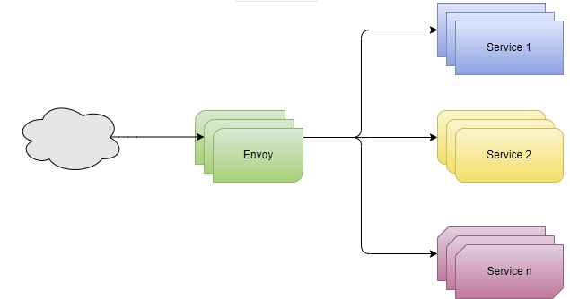
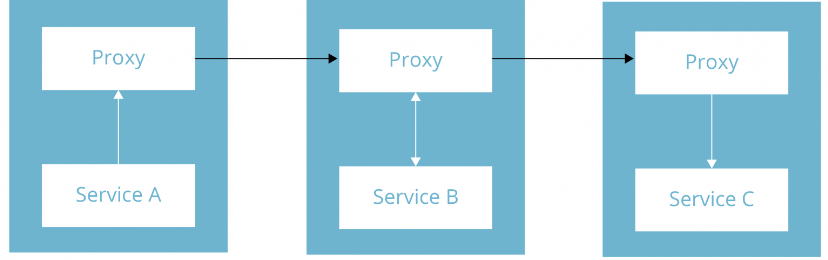
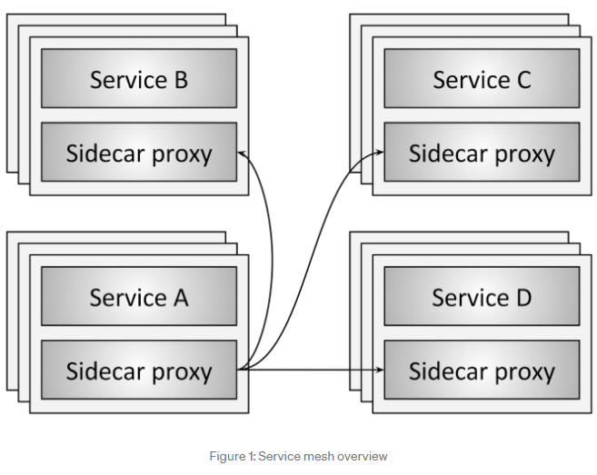

# Apuntes Envoy Proxy

**Get started with Envoy Proxy in 5 minutes**

https://www.tetrate.io/blog/get-started-with-envoy-in-5-minutes/

___

**Using Envoy Proxy to Improve Reliability, Security, and Observability of Microservices**

https://betterprogramming.pub/using-envoy-proxy-to-improve-reliability-security-and-observability-of-microservices-85032e08d3f4

~~~
static_resources:
  listeners:
  - address:
      socket_address:
        address: "0.0.0.0"
        port_value: 8585
    filter_chains:
    - filters:
      - name: envoy.filters.network.http_connection_manager
        typed_config:
          "@type": type.googleapis.com/envoy.extensions.filters.network.http_connection_manager.v3.HttpConnectionManager
          codec_type: auto
          stat_prefix: ingress_http
          route_config:
            name: local_route
            virtual_hosts:
            - name: "http-route"
              domains:
              - "*"
              routes:
              - match:
                  prefix: "/greeting"
                route:
                  cluster: greetingservice
          http_filters:
            -
                name: envoy.filters.http.router

  
  clusters:
  - name: greetingservice
    connect_timeout: 0.25s
    type: strict_dns
    lb_policy: round_robin
    load_assignment:
      cluster_name: greetingservice
      endpoints:
      - lb_endpoints:
        - endpoint:
            address:
              socket_address:
                address: "0.0.0.0"
                port_value: 8080
  
admin:
  access_log_path: "/dev/null"
  address:
    socket_address:
      address: 0.0.0.0
      port_value: 9901

~~~

___

**Configuring a basic Envoy proxy**

https://techtalkker.com/envoy-proxy-basics/

~~~
static_resources:
  listeners:
  - name: listener_0
    address:
      socket_address:
        address: 0.0.0.0
        port_value: 10000

~~~

~~~
static_resources:
  listeners:
  - name: listener_0
    address:
      socket_address:
        address: 0.0.0.0
        port_value: 10000
    filter_chains:
    # list of filter chains.
    - filters:
      # list of filters for the filter chain.
      - name: envoy.filters.network.http_connection_manager
        typed_config:
          # helps in identifying the type of the filter that we have used which is http_connection_manager.
          "@type": type.googleapis.com/envoy.extensions.filters.network.http_connection_manager.v3.HttpConnectionManager
          # list of http filters which is different from the filters for the filter chain.
          http_filters:
          - name: envoy.filters.http.router

~~~

~~~
route_config:
  name: local_route
  virtual_hosts:
  - name: local_service
    domains: ["*"]
    routes:
    - match:
        path: "/serviceA"
        ...
    - match:
        path: "/serviceB"
        ...
    - match:
        prefix: "/"
        ... 

    

~~~

~~~
static_resources:
  listeners:
  - name: listener_0
    address:
      socket_address:
        address: 0.0.0.0
        port_value: 10000
    filter_chains:
    - filters:
      - name: envoy.filters.network.http_connection_manager
        typed_config:
          "@type": type.googleapis.com/envoy.extensions.filters.network.http_connection_manager.v3.HttpConnectionManager
          http_filters:
          - name: envoy.filters.http.router
          stat_prefix: ingress_http
          route_config:
            name: local_route
            virtual_hosts:
            - name: local_service
              domains: ["*"]
              routes:
              - match:
                  path: "/serviceA"
                route:
                  cluster: service_a
              - match:
                  path: "/serviceB"
                route:
                  cluster: service_b
              - match:
                  prefix: "/"  
                direct_response:
                  status: 404
                  body: 
                    inline_string: "page not found"

~~~

~~~
clusters:
  - name: service_a
    connect_timeout: 0.25s
    type: LOGICAL_DNS
    dns_lookup_family: V4_ONLY
    lb_policy: ROUND_ROBIN
    load_assignment:
      cluster_name: service_a
      endpoints:
      - lb_endpoints:
        - endpoint:
            address:
              socket_address:
                address: serviceA
                port_value: 3000

  - name: service_b
    connect_timeout: 0.25s
    type: LOGICAL_DNS
    dns_lookup_family: V4_ONLY
    lb_policy: ROUND_ROBIN
    load_assignment:
      cluster_name: service_b
      endpoints:
      - lb_endpoints:
        - endpoint:
            address:
              socket_address:
                address: serviceB
                port_value: 3000

~~~

~~~
static_resources:
  listeners:
  - name: listener_0
    address:
      socket_address:
        address: 0.0.0.0
        port_value: 10000
    filter_chains:
    - filters:
      - name: envoy.filters.network.http_connection_manager
        typed_config:
          "@type": type.googleapis.com/envoy.extensions.filters.network.http_connection_manager.v3.HttpConnectionManager
          stat_prefix: ingress_http
          route_config:
            name: local_route
            virtual_hosts:
            - name: local_service
              domains: ["*"]
              routes:
              - match:
                  path: "/serviceA"
                route:
                  cluster: service_a
              - match:
                  path: "/serviceB"
                route:
                  cluster: service_b
              - match:
                  prefix: "/"  
                direct_response:
                  status: 404
                  body: 
                    inline_string: "page not found"
          http_filters:
          - name: envoy.filters.http.router

  clusters:
  - name: service_a
    connect_timeout: 0.25s
    type: LOGICAL_DNS
    dns_lookup_family: V4_ONLY
    lb_policy: ROUND_ROBIN
    load_assignment:
      cluster_name: service_a
      endpoints:
      - lb_endpoints:
        - endpoint:
            address:
              socket_address:
                address: serviceA
                port_value: 3000

  - name: service_b
    connect_timeout: 0.25s
    type: LOGICAL_DNS
    dns_lookup_family: V4_ONLY
    lb_policy: ROUND_ROBIN
    load_assignment:
      cluster_name: service_b
      endpoints:
      - lb_endpoints:
        - endpoint:
            address:
              socket_address:
                address: serviceB
                port_value: 3000

~~~

~~~

~~~

___

**GETTING STARTED WITH ENVOY & OPEN POLICY AGENT — 01 —**

USING ENVOY AS A FRONT PROXY

https://helpfulbadger.github.io/blog/envoy_opa_1_front_proxy/

- **Front proxy**

- **Sidecar proxy**

___

**Building a Service Mesh with Envoy**

https://www.thoughtworks.com/insights/blog/building-service-mesh-envoy-0

Habla y da un repositorio github de control de plano llamado envoy-pilot y es una extension de go-control-plane

https://github.com/tak2siva/Envoy-Pilot

~~~
admin:
  access_log_path: "/tmp/admin_access.log"
  address: 
    socket_address: 
      address: "127.0.0.1"
      port_value: 9901
static_resources: 
  listeners:
    - 
      name: "http_listener"
      address: 
        socket_address: 
          address: "0.0.0.0"
          port_value: 80
      filter_chains:
          filters: 
            - 
              name: "envoy.http_connection_manager"
              config:
                stat_prefix: "ingress"
                route_config: 
                  name: "local_route"
                  virtual_hosts: 
                    - 
                      name: "http-route"
                      domains: 
                        - "*"
                      routes: 
                        - 
                          match: 
                            prefix: "/"
                          route:
                            cluster: "service_a"
                http_filters:
                  - 
                    name: "envoy.router"
  clusters:
    - 
      name: "service_a"
      connect_timeout: "0.25s"
      type: "strict_dns"
      lb_policy: "ROUND_ROBIN"
      hosts:
        - 
          socket_address: 
            address: "service_a_envoy"
            port_value: 8786

~~~

~~~
admin:
  access_log_path: "/tmp/admin_access.log"
  address: 
    socket_address: 
      address: "127.0.0.1"
      port_value: 9901
static_resources:
  listeners:

    -
      name: "service-a-svc-http-listener"
      address:
        socket_address:
          address: "0.0.0.0"
          port_value: 8786
      filter_chains:
        -
          filters:
            -
              name: "envoy.http_connection_manager"
              config:
                stat_prefix: "ingress"
                codec_type: "AUTO"
                route_config:
                  name: "service-a-svc-http-route"
                  virtual_hosts:
                    -
                      name: "service-a-svc-http-route"
                      domains:
                        - "*"
                      routes:
                        -
                          match:
                            prefix: "/"
                          route:
                            cluster: "service_a"
                http_filters:
                  -
                    name: "envoy.router"
    -
      name: "service-b-svc-http-listener"
      address:
        socket_address:
          address: "0.0.0.0"
          port_value: 8788
      filter_chains:
        -
          filters:
            -
              name: "envoy.http_connection_manager"
              config:
                stat_prefix: "egress"
                codec_type: "AUTO"
                route_config:
                  name: "service-b-svc-http-route"
                  virtual_hosts:
                    -
                      name: "service-b-svc-http-route"
                      domains:
                        - "*"
                      routes:
                        -
                          match:
                            prefix: "/"
                          route:
                            cluster: "service_b"
                http_filters:
                  -
                    name: "envoy.router"

    -
      name: "service-c-svc-http-listener"
      address:
        socket_address:
          address: "0.0.0.0"
          port_value: 8791
      filter_chains:
        -
          filters:
            -
              name: "envoy.http_connection_manager"
              config:
                stat_prefix: "egress"
                codec_type: "AUTO"
                route_config:
                  name: "service-b-svc-http-route"
                  virtual_hosts:
                    -
                      name: "service-b-svc-http-route"
                      domains:
                        - "*"
                      routes:
                        -
                          match:
                            prefix: "/"
                          route:
                            cluster: "service_c"
                http_filters:
                  -
                    name: "envoy.router"                                
  clusters:
      -
        name: "service_a"
        connect_timeout: "0.25s"
        type: "strict_dns"
        lb_policy: "ROUND_ROBIN"
        hosts:
          -
            socket_address:
              address: "service_a"
              port_value: 8081  
      -
        name: "service_b"
        connect_timeout: "0.25s"
        type: "strict_dns"
        lb_policy: "ROUND_ROBIN"
        hosts:
          -
            socket_address:
              address: "service_b_envoy"
              port_value: 8789

      -
        name: "service_c"
        connect_timeout: "0.25s"
        type: "strict_dns"
        lb_policy: "ROUND_ROBIN"
        hosts:
          -
            socket_address:
              address: "service_c_envoy"
              port_value: 8790

~~~

___

**Integrating Service Discovery with Envoy**

https://blog.turbinelabs.io/integrating-service-discovery-with-envoy-19d871e6d0ad

Control Plane Implementation

go-control-plane

https://github.com/envoyproxy/go-control-plane

___

**Service mesh data plane vs. control plane**

https://blog.envoyproxy.io/service-mesh-data-plane-vs-control-plane-2774e720f7fc

La malla de servicio se puede aplicar al plano de datos o al de control.

**The data plane**

In a service mesh, the sidecar proxy performs the following tasks:

- Service discovery

- Health checking

- Routing

- Load balancing

- Authentication and authorization

- Observability

**The control plane**

**Data plane vs. control plane summary**

- Service mesh data plane

- Service mesh control plane

