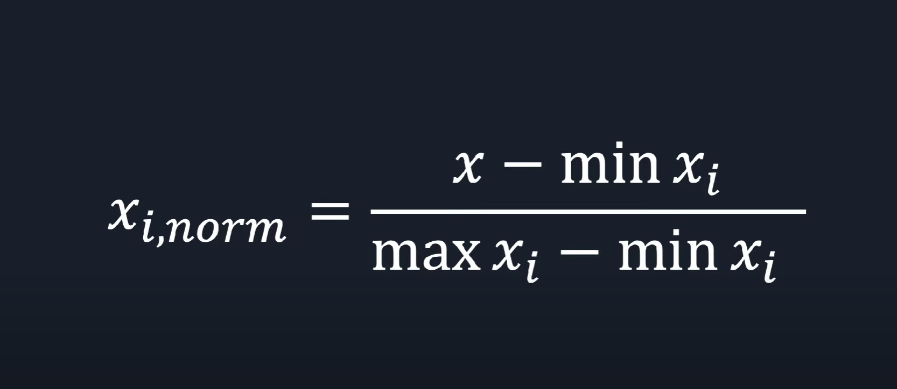
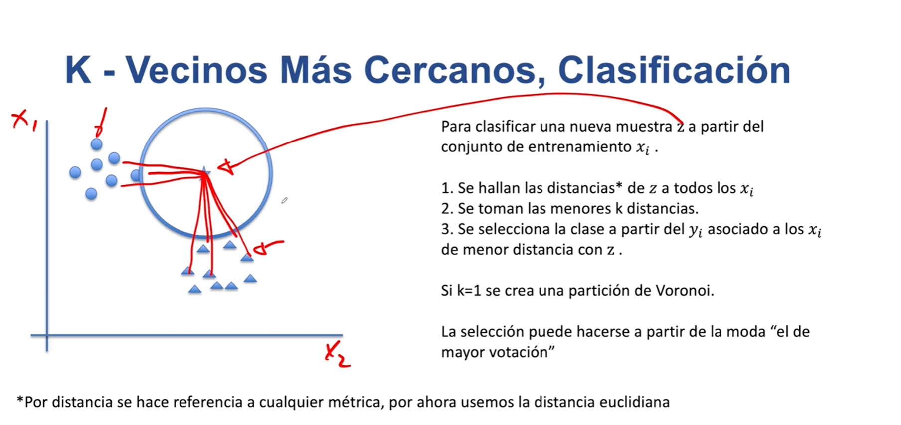
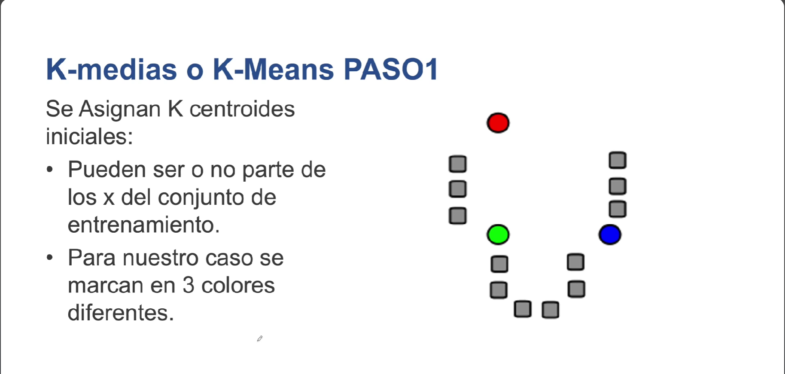
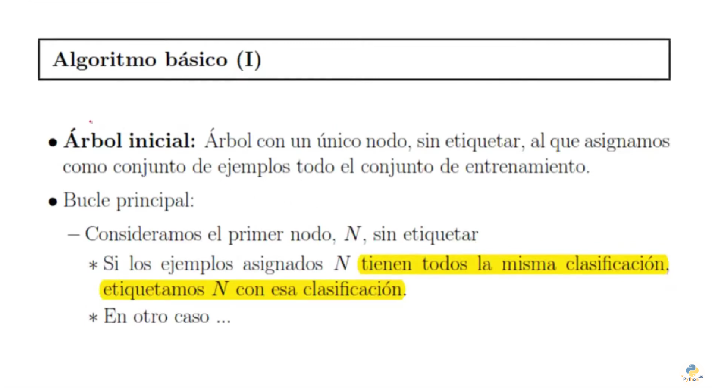

# Apuntes IA Machine Learning
---
## Clasificacion 

---
## ¿Cuál es la diferencia entre el aprendizaje supervisado y el no supervisado?

Autor:Copia de articulo de Amazon AWS

https://aws.amazon.com/es/compare/the-difference-between-machine-learning-supervised-and-unsupervised/

El machine learning (ML) supervisado y no supervisado son dos categorías de algoritmos de ML. Los algoritmos de ML procesan grandes cantidades de datos históricos para identificar patrones de datos mediante inferencia. 

Los algoritmos de aprendizaje supervisado se entrenan con datos de muestra que especifican tanto la entrada como la salida del algoritmo. Por ejemplo, los datos podrían ser imágenes de números escritos a mano que se anotan para indicar qué números representan. Si se proporcionan suficientes datos etiquetados, el sistema de aprendizaje supervisado finalmente reconocerá los clústeres de píxeles y las formas asociados a cada número escrito a mano. 

Por otra parte, los algoritmos de aprendizaje no supervisado se entrenan con datos sin etiquetar. Analizan los nuevos datos y establecen conexiones significativas entre la entrada desconocida y las salidas predeterminadas. Por ejemplo, los algoritmos de aprendizaje no supervisado podrían agrupar artículos de noticias de diferentes sitios de noticias en categorías comunes, como deportes y crímenes.

### Técnicas de aprendizaje supervisado y de aprendizaje no supervisado

En machine learning (ML), se enseña a una computadora a efectuar predicciones o inferencias. En primer lugar, se utiliza un algoritmo y datos de ejemplo para entrenar un modelo. Luego, se integra el modelo a su aplicación para generar inferencias en tiempo real y a escala. El aprendizaje supervisado y el no supervisado son dos categorías distintas de algoritmos.

#### Aprendizaje supervisado

En el aprendizaje supervisado, el modelo se entrena con un conjunto de datos de entrada y el conjunto correspondiente de datos de salida etiquetados en pares. Por lo general, el etiquetado se realiza de forma manual. A continuación, se presentan algunos tipos de técnicas de machine learning supervisado.

- <u>*Regresión logística*</u>:
La regresión logística predice un resultado categórico en función de una o más entradas. La clasificación binaria se produce cuando el resultado se ajusta a una de dos categorías, como sí o no y aprobado o desaprobado. La clasificación de clases múltiples se produce cuando el resultado coincide con más de dos categorías, como gato, perro o conejo.  Un ejemplo de regresión logística es predecir si un estudiante aprobará o reprobará una unidad en función del número de inicios de sesión en el software del curso.

- <u>*Regresión lineal*</u>:
La regresión lineal se refiere a los modelos de aprendizaje supervisado que, basándose en una o más entradas, predicen un valor a partir de una escala continua. Un ejemplo de regresión lineal es la predicción del precio de una casa. Podría predecir el precio de una casa en función de su ubicación, antigüedad y cantidad de habitaciones, después de entrenar el modelo con un conjunto de datos de entrenamiento sobre ventas históricas con esas variables.

- <u>*Árbol de decisiones*</u>:
La técnica de machine learning supervisado de árbol de decisiones toma algunas entradas determinadas y aplica una estructura de condición para predecir un resultado. Un ejemplo de un problema de árbol de decisiones es la predicción de la pérdida de clientes. Por ejemplo, si un cliente no visita una aplicación después de registrarse, el modelo podría predecir la pérdida de clientes. O bien, si el cliente accede a la aplicación en varios dispositivos y el tiempo medio de sesión supera un límite determinado, el modelo podría predecir su retención.

- <u>*Red neuronal*</u>:
Una solución de red neuronal es una técnica de aprendizaje supervisado más compleja. Para producir un resultado determinado, toma algunas entradas particulares y lleva a cabo una o más capas de transformación matemática basadas en el ajuste de las ponderaciones de los datos. Un ejemplo de una técnica de red neuronal es la predicción de un dígito a partir de una imagen escrita a mano.

#### Aprendizaje no supervisado

El machine learning no supervisado se produce cuando se proporcionan datos de entrada al algoritmo sin ningún dato de salida etiquetado. Luego, por sí solo, el algoritmo identifica patrones y relaciones en los datos y entre ellos. A continuación, se presentan algunos tipos de técnicas de aprendizaje no supervisado.

- <u>*Agrupación en clústeres*</u>:
La técnica de aprendizaje no supervisado de agrupación en clústeres agrupa ciertas entradas de datos, por lo que pueden clasificarse como un todo. Existen diversos tipos de algoritmos de agrupación en clústeres en función de los datos de entrada. Un ejemplo de agrupación en clústeres es la identificación de diferentes tipos de tráfico de red para predecir posibles incidentes de seguridad.

- <u>*Aprendizaje de reglas de asociación*</u>:
Las técnicas de aprendizaje de reglas de asociación descubren relaciones basadas en reglas entre las entradas de un conjunto de datos. Por ejemplo, el algoritmo Apriori lleva a cabo un análisis del carrito del supermercado para identificar reglas como la de que el café y la leche suelen comprarse juntos.

- <u>*Densidad de probabilidad*</u>:
Las técnicas de densidad de probabilidad en el aprendizaje no supervisado predicen la probabilidad o la posibilidad de que el valor de una salida esté dentro del rango de lo que se considera normal para una entrada. Por ejemplo, un medidor de temperatura en una sala de servidores normalmente registra entre un cierto rango de grados. Sin embargo, si de repente mide un número bajo en función de la distribución de probabilidad, puede indicar un mal funcionamiento del equipo. 

- <u>*Reducción de dimensionalidad*</u>:
La reducción de la dimensionalidad es una técnica de aprendizaje no supervisado que reduce la cantidad de características en un conjunto de datos. A menudo se usa para preprocesar los datos para otras funciones de machine learning y reducir la complejidad y la sobrecarga. Por ejemplo, puede difuminar o recortar las características del fondo en una aplicación de reconocimiento de imágenes.

#### Cuándo usar el aprendizaje supervisado o el no supervisado

Puede utilizar técnicas de aprendizaje supervisado para resolver problemas con resultados conocidos y que tengan datos etiquetados disponibles. Los ejemplos incluyen la clasificación del correo electrónico no deseado, el reconocimiento de imágenes y las predicciones del precio de las acciones en función de los datos históricos conocidos.

Puede utilizar el aprendizaje no supervisado para situaciones en las que los datos no están etiquetados y el objetivo es descubrir patrones, agrupar instancias similares o detectar anomalías. También puede usarlo para tareas exploratorias en las que no haya datos etiquetados. Los ejemplos incluyen la organización de grandes archivos de datos, la creación de sistemas de recomendación y la agrupación de los clientes en función de sus comportamientos de compra.

#### Resumen de las diferencias: aprendizaje supervisado y no supervisado
|           | Aprendizaje supervisado                                                                                                         | Aprendizaje no supervisado                                                                                                                                                  |
|-----------|---------------------------------------------------------------------------------------------------------------------------------|-----------------------------------------------------------------------------------------------------------------------------------------------------------------------------|
| ¿Qué es?  | El modelo se entrena con un conjunto de datos de entrada y el conjunto correspondiente de datos de salida etiquetados en pares. | Esto se hace para que el modelo descubra patrones ocultos en los datos sin etiquetar.                                                                                       |
| Técnicas  | Regresión logística, regresión lineal, árbol de decisiones y red neuronal                                                       | Agrupamiento en clústeres, aprendizaje de reglas de asociación, densidad de probabilidad y reducción de dimensionalidad                                                     |
| Objetivo  | 	Prediga una salida en función de las entradas conocidas.                                                                       | Identifique información valiosa sobre las relaciones entre los puntos de datos de entrada. Luego, esto se puede aplicar a nuevas entradas para obtener información similar. |
| Enfoque   | Minimice los errores entre las salidas previstas y las etiquetas verdaderas.                                                    | 	Encuentre patrones, similitudes o anomalías en los datos.                                                                                                                  |

---
## ¿Qué es el aprendizaje no supervisado y cuándo usarlo?

https://www.inesdi.com/blog/que-es-aprendizaje-no-supervisado/

Algoritmos de aprendizaje no supervisado

- Agrupamiento

- Asociación

Estos son algunos de los algoritmos de aprendizaje sin supervisión más ​​populares:

- KNN (vecinos más cercanos)
- Agrupación jerárquica
- Detección de anomalías
- Redes neuronales
- Análisis de componentes principales
- Análisis de componentes independientes
- Algoritmo a priori
- ECLAT
- Valor singular de descomposición

---
## Aprendizaje no Supervisado

https://aprendeia.com/aprendizaje-no-supervisado-machine-learning/

Tipos de Aprendizaje no Supervisado

Los problemas de Aprendizaje no Supervisados se agrupan en problemas de agrupación y asociación.

### Agrupamiento

El agrupamiento es un concepto importante cuando se trata de Aprendizaje no Supervisado. Se trata principalmente de encontrar una estructura o patrón en una colección de datos no categorizados. Los algoritmos de agrupamiento o clústeres, como se le conoce en inglés, procesarán los datos y encontrarán grupos o clústeres naturales si existen en los datos. También se puede modificar cuántos grupos deben identificar sus algoritmos. Permite ajustar la granularidad de estos grupos.

Existen diferentes tipos de agrupamiento que se puede utilizar:

- Exclusivo (partición): en este método de agrupación, los datos se agrupan de tal manera que un dato solo puede pertenecer a un clúster o grupo. Ejemplo: K Means.

- Aglomerativo: en esta técnica de agrupación de agrupamiento, cada dato es un clúster. Las uniones iterativas entre los dos clústeres más cercanos reducen el número de clústeres. Ejemplo: agrupación jerárquica.

- Solapamiento: en esta técnica, se utilizan conjuntos difusos para agrupar datos. Cada punto puede pertenecer a dos o más grupos con distintos grados de afiliación. Aquí los datos se asociarán con un valor de membresía apropiado. Ejemplo: Fuzzy C-Means.

- Probabilístico: esta técnica utiliza la distribución de probabilidad para crear los clústeres.

### Asociación
Las reglas de asociación te permiten establecer asociaciones entre objetos de datos dentro de grandes bases de datos. Esta técnica no supervisada trata de descubrir relaciones interesantes entre variables en grandes bases de datos. Por ejemplo, las personas que compran una casa nueva tienen más probabilidades de comprar muebles nuevos.

---
## Modelos supervisados machine learning

https://seon.io/es/recursos/glosario/modelos-supervisados-machine-learning/

Machine learning supervisado (SML)

¿Cuáles son los diferentes tipos de aprendizaje supervisado en machine learning?

Existen dos tipos principales de modelos supervisados machine learning en función de los problemas que abordan: *clasificación* y *regresión*. Sin embargo, los numerosos métodos para abordar estos problemas hacen que existan muchas subcategorías de enfoques de aprendizaje supervisado.

### Clasificacion:

La clasificación se refiere al problema de garantizar que los algoritmos de SLM asignen correctamente una etiqueta de clase a sus conjuntos de datos

Hay muchos ejemplos de algoritmos de aprendizaje supervisado que abordan el problema de la clasificación, como:

- árboles de decisión
- bosque aleatorio
- redes neuronales
- refuerzo de gradiente
- máquinas de vectores soporte
- Naive Bayes

### Regresion:

La regresión se refiere al problema de garantizar que los algoritmos SML determinen correctamente la relación que se produce entre las variables independientes y dependientes

Los tipos de algoritmos de aprendizaje supervisado que abordan el problema de la regresión son amplios y cada vez más numerosos, pero entre los ejemplos más destacados se incluyen:

- regresión lineal
- regresión logística
- regresión polinómica
- regresión de red elástica
- regresión ridge
- regresión lasso

---
## ¿Qué es el algoritmo de k vecinos más cercanos?
metodo aprendizaje no supervisado

https://www.ibm.com/es-es/topics/knn

---
## Dominando K-NN | Vecinos Más Cercanos en Machine Learning
metodo aprendizaje no supervisado

https://www.youtube.com/watch?v=3lQHYSFUlzo

Poner una escala:

---
## K Vecinos Más cercanos para clasificación y regresión
metodo aprendizaje no supervisado

https://www.youtube.com/watch?v=HHsA2ZqIa2M

autor: Francisco Carlos Calderon

esquemas:

---
## K means
metodo aprendizaje no supervisado

https://www.youtube.com/watch?v=duCdeTh-4yc

autor: Francisco Carlos Calderon

---

### K-means Parte 2 Selección del K óptimo

metodo aprendizaje no supervisado

https://www.youtube.com/watch?v=SO2_am1OeCI

autor: Francisco Carlos Calderon

---

### Regresión lineal Univariada Parte 1

metodo aprendizaje supervisado

https://www.youtube.com/watch?v=yJ8J0bfgXrI

autor: Francisco Carlos Calderon

 

---
## Aprendizaje con Reglas de Asociación | Algoritmo Apriori

Algoritmos de aprendizaje no supervisado

https://www.youtube.com/watch?v=YRhu6yEseh8

---
## Árboles de Decisión en Python: Teoría y Ejemplo Práctico

Algoritmos de aprendizaje supervisado

https://www.youtube.com/watch?v=2fb39TnkxoI

---

---

