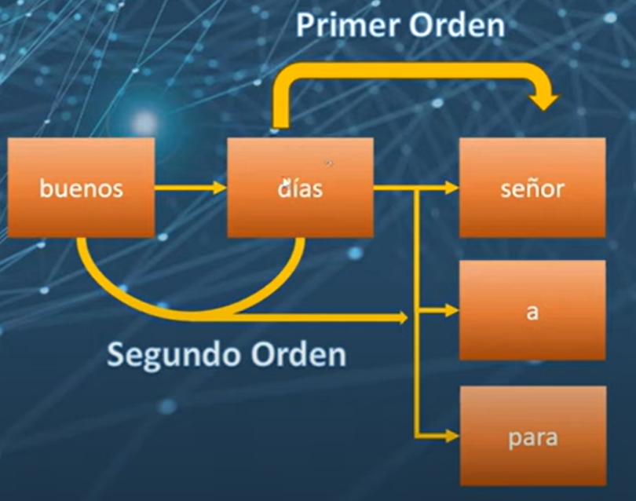
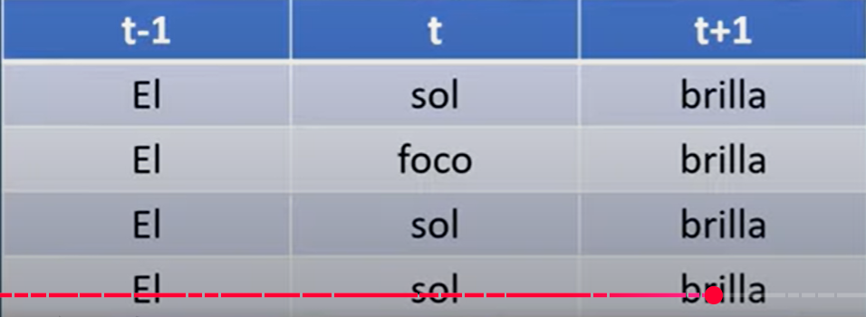

# Apuntes procesamiento de lenguaje natural

---
## Curso Completo de Procesamiento de Lenguaje Natural (NLP) con Python

https://www.youtube.com/watch?v=9x1QtYNLJRY

Codigo espinoza

## bolsa de palabras

-El orden de las palabras

## metodo de conteo
las ocurrencias o frecuencia con que aparecen cada palabra en el texto o secuencia de palabras.

## Tokenizacion
dividir el texto en tokens
los tokens son las unidades individuales de un texto

Tokenizacion basada en palabras
       ''    basada en caracteres
basada en sub-palabras(automivil -> auto, movil)

Diferentes casos de letras(tildes por ejemplo)
Tokenizar por palabras completas, caracteres o sub-palabras
Puntuacion( tener en cuenta puntos o comas o otros signos como exclamacion,interrogacion)

Manejo de los casos de las letras (mayusculas y minusculas)

-Mapeo

## Stop words o palabras de parada

~~~
import nltk
from nltk.corpus import stopwors
from nltk.tokenize import word_tokenize
nltk.download('stopwords')

stop_words = set(stopworsd.worsd('spanish'))
print(stop_words)

texto= "El gato es negro y el perro es blanco"
texto = texto.lower()

tokens = word_tokenize(texto)
print(tokens)

texto_filtrado = [word for word in tokens if not word in stop_words]

print(texto_filtrado)

~~~

## STEMMING Y LEMMATIZATION

Probelams de la tokenizacion basica y recuento

Las palabras similares se tratan como entidades separadas.
El alto dimensional de los vectores resultantes.
Aplicaciones practivas y desventajas de la tokenizacion basica.

El Stemming es una tecnica mas simple que simplemente elimina los sufijos de las palabras.
La lemmatization es una tecnica mas sotisficada que utiliza las reglas del lenguaje para obtener la base o raiz de una palabra.

~~~
import nltk

nltk.download('wordnet')

from nltk.stem import SnowballStemmer

stemmer = SnowballStemmer('spanish')

print(stemmer.stem('caminando'))
print(stemmer.stem('caminar'))
print(stemmer.stem('camino'))

pip install spacy -q

import spacy

nlp=spacy.load("es_core_news_sm")

nlp = nlp("caminar caminando camino")

for token in doc:
   print(token.text,"->",token.lemma_)

~~~

- Particularidades de la Lemmatization y recomendaciones para su uso
La lemmatization puede ser mas efectiva que el stemming, pero tambien es mas costosa computacionalmente
El uso de la lemmatization puede requerir el etiquetado previo.

- Aplicacion de Stemming y Lemmatization en situaciones reales

Asistentes virtuales y Chatbos.
Analisis de sentimientos.
Motores de busqueda.
Sistemas de recomendacion.
Aplicacion en publicidad online y etiquetas de redes sociales.

- Ejemplo practico

~~~

~~~

~~~

~~~

## Similitud de vectores

Similitud de documentos.
Spinning de articulos y SEO. (spining) variar el articulo, y que diga lo mismo con otras palabras
Recomendaciones.
Chat bots.

- Calcular Similitud de Vectores

Distancia Euclidiana

Angulo entre vectores. Distancia coseno

En el procesamiento del Lenguaje Natural, a menudo se prefiere la similitud del coseno porque toma en cuenta el angulo entre los vectores, que pueden ser mas relevante en contextos donde los vectores representan textos o palabras.

##  Metodo TF-IDF

LA frecuencia del termino Term frecuency (TF), frecuencia inversa del documento IDF

Problemas con el metodo conteo:

No toma en cuenta la relevancia de las palabras.
TF-IDF reduce el peso de las palabras comunes y aumenta el peso de las palabras que no se utilizan con frecuencia.

Stop Words

Palabras comunes como si, la, el mas,etc.
Si se dejan en el texto, pueden sesgar el analisis hacia las palabras mas comunes.
Eliminar las stop words puede hacer que los algoritmos sean mas precisos y rapidos, ya que hay menos palabras a procesar.

Ambiguedad y especificidad de las stop words dependiendo de la aplicacion.

No todas las palabras comunes son stop words en todas las situaciones

Por ejemplo, "no" podria ser una stop word en muchos contextos, pero no en el analisis de sentimientos, donde podria ser una palabra clave.

Descripcion de como funciona TF-IDF

TF-IDF funciona al asignar un puntaje a cada palabra en un documento en funcion de su frecuencia en ese documento (TF) y su frecuencia en todos los documentos (IDF).

Cuanto mas a menudo aparece una palabra en un solo documento, pero menos a menudo en todos los documentos, mayor es su puntaje TF-IDF.

Las palabras que aparecen con mas frecuencia en un documento pero raramentente en otros documento son mas importantes.

-Formulacion de TF-IDF y su justificacion

TF-IDF se calcula multiplicando dos componentes: TF e IDF.

TF se calcula como el numero de veces que aparece una palabra en un documento dividido por el total de palabras en ese documento

IDF se calcula como el logaritmo del total de documentos dividido por el numero de documentos que contienen la palabra

TF-IDF = TF(t,d)*IDF(t,D)

TF(t,d)= (Numero de veces que el termino t aparece en el documento d)/(Total de terminos en el documento d)

IDF(t,D)=log_e(total de documentos en el corpus D / Numero de documentos donde el termino t aparece)

## Aplicacion TF-IDF. Recomendacion de peliculas

~~~
import pandas as pd
dt = pd.read_csv('movie_metadata.csv')

df['genero'] = df['genero'].str.replace('|',' ')

df['plot_keywords'] = df['plot_keywords'].str.replace('|',' ')

df['Texto']= df[['genero','plot_keywords']].apply(lambda row: ' '.join(row.values.astype(srt)),axis=1)

row = df[['genero','plot_keywords','texto']].iloc[0]
print(row)

from sklearn.feature_extraction.text import TfidFVectorizer
from sklearn.metrics.pairwise import cosine_similarity,euclidean_distances

tfidf = TfidfVectorizere(max_features=2000)

X= tfidf.fit_transform(df['texto])

peliculas = pd.Series(df.index,index=df['movie_title'])

peliculas.index = peliculas.index.str.strip()

indice = peliculas['The Dark Knight Rises']

consulta = X[indice]

similitud = cosine_similiraty(consulta,X)

similitud = similitud.flatten()

import matplotlib.pyplot as plt

plt.plot(similitud)

(-similitud).argsort() # orden descendente

~~~

## Neural word embedings

Antes podiamos hacer por bolsa de palabras
Ejemplo de bolsa de palabras

pero podemos convertir las palabras en vectores.

- Metodos de vectorizacion

Conversion de documentos en vectores(Bolsa de palabreas,TF-IDF).
Palabras a vectores.
Descripcion de la representacion de documentos mediante una secuencia de vectores(Embeddings).

-Modelos para secuencias en aprendizaje profundo

Modelos construidos para secuencias (CNN,RNN,Transformes). CNN -> clasificacion positiva o negativa reseñas
Relevancia del orden de las palabras en una sentencia.
Aplicaciones en traduccion de idiomas, respuestas a preguntas, chat bots, y mas.

-Incrustaciones de palabras (World embeddings)

Introduccion a Word2Vec y Glove
Uso de redes neuronales en Word2Vec
    Continuous Bag of Words (CBOW) y Skip-Gram

Descripcion de Glove y su relacion con los sistemas de recomendacion

Descripcion general del proceso de formacion de una red neuronal

- Uso practivo de Word embeddings.

Comparacion entre las incrustaciones de palabras y otros metodos de vectorizacion.
Descripcion de analogias de palabras con incrustaciones de palabras.

## Ejemplo de Word Embeddings : Analogias

En kaggle hay una data llamada Pre-Trained Word Vectors for spanish ocupa 1GB 
SW-vectors-300-min5.txt

Data que ya esta entrenada

~~~
!pip install gensim -q

import gensim

vectores = gensim.models.keydVectors.load_word2vec_format('SW-vectors-300-min5.txt')

def analogias(v1,v2,v3):
    similitud = vectores.most_similar(positive=[v1,v3],negative=[v2])
    print(f"{v1} es a {v2} como {similitud[0][0]} es a {v3}")

analogias('rey','hombre','mujer')

analogias('pan','trigo','huevo')

def cercanos(v):
   vecinos = vectores.most_similar(positive=[v])
   print(f"vecinos de : {v}")
   for word,score in vecinos:
      print("\t%s" % word)

cercanos('rey')

cercanos('Chile')
#diferencia entre mayusculas y minusculas
cercanos('chile')

~~~

https://www.kaggle.com/datasets/rtatman/pretrained-word-vectors-for-spanish

## Crear tus propios Embeddings con word2vec

Word2Vec es un modelo que se utiliza para aprender representaciones vectoriales de palabras. Estas representaciones pueden capturar muchas propiedades linguisticas de las palabras, como su significado semantico y gramaticas y hasta contextual.

~~~
pip install pypdf2 -q

import string
from gensim.models import Word2Vec
import PyPDF2

# carga del documento
with open('Minecraft.txt','r',encoding='utf-8') as file:
    documento = file.read()

len(documento)

# preprocesamiento de datos, vamos a dividir en oraciones, y luego en palabreas

oraciones = documento.split('.')

len(oraciones)

print(oraciones[0])

oraciones_limpias=[]
for oracion in oraciones:
     #Eliminar la puntuacion y dividir por espacios
     tokens = oracion.trasnlate(str.maketrans('','',string.puntuation)).split()
     print(tokens)
     # convertir a minusculas
     tokens = [word.lower() for word in tokends if word.isalpha()]
     if tokens: #Añadir si solo hay tokens
         oraciones_limpias.append(tokens)
     

 print(oraciones_limpia[0])

 # Entrenar el modelo word2vec

 model = Word2Vec(sentences= oraciones_limpias,vector_size=500, windows=5,min_count=1 workders=8)

 vector = model.wv['minecraft']

 palabras_cercanas = model.wv.most_similar("minecraft",topn=10)
 palabras_cercanas

 #guardar el modelo

 model.save('minecraft.model')

 modelo_cargado = Word2Vec.load('minecraft.model')
# guardar solo los embeddings
 model.wv.save_word2vec_format('mine_emb.txt',binary=False)
 model.wv.save_word2vec_format('mine_emb.bin',binary=True)

 # para cargar un embeddings

 from gensim.models import KeyedVectors

 embeddings_cargardos = KeyedVectors.load_word2vec_format('embeddings.txt',binary=False)

def analogias(v1,v2,v3):
    similitud = embeddings_cargados.most_similar(positive=[v1,v3],negative=v2)
    print(f"{v1} es a {v2} como {similitud[0][0]} es a {v3}")

# vamos a entrenar con el libro de 100 años de soledad

def extraer_texto_desde_pdf(ruta_archivo):
      with open(ruta_archivo,'rb') as archivo:
           lector = PyPdf2.PdfReader(archivo)
           texto = ""
           for pagina in range(len(lector.pages)):
               texto += lector.pages[pagina].extract_text()
      return texto

documento = extraer_texto_desde_pdf('100as.pdf')

len(documentos)

# dividir el documento en frases  usando la coma como separador

oraciones = documento.split(',')

len(oraciones)

~~~

Cargar bastante pdf para hacer un modelo mas grande de embeddings a ver que pasa

~~~

~~~

## Modelos Probabilisticos (Modelos de Markov)

Aplicabilidad Universal de los modelos de Markov

Finanzas.
Aprendizaje por refuerzo.
Modelos Ocultos de Markov.
Cadena de Markov Monte Carlo (MCMC).

Propiedad Fundamental de los Modelos de Markov.

Es como cunado solo consideras el clima de hoy para predecir el de mañana, ignorando como estuvo la semana pasada.

Estructura y Entrenamiento de un Modelo de Markov

Definicion y Componentes del modelo . Si esta Soleado, Lluvia, Nublado, etc.
Matriz de Transicion de Estados.
Entrenamiento del Modelo.

Aplicaciones en el PLN (Proceso de Lenguaje Natural).

Clasificacion de Texto(spam).
Generacion de Texto Original(Poemas).
Diferencia entre Aprendizaje Supervisado y no supervisado.

Resumen:

Los Modelos de Markov son esencialmente sistemas que pasan de un estado a otro con ciertas probabilidades.

Estas probabilidades no dependen de como llego al estado actual, sino solo del estado actual en si.

## Modelos de Markov

Representacion Matematica:

Si tenemos tres estados: A,B,C. La probabilidad de pasar de A a B prodria ser representada por P(B|A)

A representa que esta soleado y B que esta nublado, P(B|A) es la probabilidad de que se vuelva nublado dado que hoy esta soleado.

Uso de los modelos de Markov para Secuencias:

Puedes usar un Modelo de Markov para predecir la siguiente palabra basandote en la actual.

Ejemplo: Supon que despues de la palabra cierlo, la palabra azul aparece un 80% de las veces. Entonces:
     P("azul"|"cielo")=0.8

Estados en Modelos de Markov

Definicion de Estados y simbolos Categoricos:
    Ejemplo: En un modelo de Markov para prever el clima, los estaedos podrian ser "Soleado","Lluvioso" y "Nublado".
    Los estaos los declararemos como S(de State)

Notacion y Representacion:
    Usando la notacion anterior, "si" puede ser "Soleado" y "sj", "Lluvioso". La probabilidad de que despues de un dia soleado venga uno dia lluvioso es 
    P(sj|si).

Convencion de Numeracion de los estados:
      Soleado=1,Lluvioso=2,Nublado=3.

Distribucion de Probabilidad de los estados:
     La suma de las probabilidades de transicion desde "Soleado" a todos los otros estados (incluyendo quedarse en "Soleado") es 1.

Transicion de Estados y Matrices de Transicion.

Dependencia de los estados Anteriores:
    Despues de un dia "Soleado", la probabilidad de que el siguiente sea "Lluvioso" no depende de si los dias anteriores fueron soleados o lluviosos.

Distribuciones Condicionales y Valores de Probabilidad:
     P("Lluvioso"|"Soleado")=0.4 y P("Nublado"|"Soleado")=0.6

Matriz de Transicion de Estado (Matriz A)

Homogeneidad en el Tiempo en Modelos de Markov

Distribucion del Estado inicial (Pj)
     Al inicio de una secuencia, no hay un estado anterior del que depender. Por eso, necesitamos una distribucion de probabilidad inicial para determinar el primer estado.
     Pi=[0.6(soleado),0.3(Nublado),0.1(Lluvioso)]

Representacion en Python

transiciones = {
   'A':{'A':0.6,'B':0.3,'C':0.1}
   'B':{'A':0.2,'B':0.7,'C':0.1}
   'C':{'A':0.2,'B':0.3,'C':0.5}
}

Implementacion Computacional y Entrenamiento.

Podemos usar bibliotecas de Python como NumPy para ayudar a representar y manipular matrices y vectores.

Con la matriz de transicion y Pi, podemos calcular la probabilidad de una secuencia especifica usando un simple bucle.

Usando datos historicos, podemos "entrenar" nuestro modelo ajustando las probabilibades hasta que representen mejor nuestros datos.(obtener matriz de transicion a partir de historicos).

Si observamos que despues de 100 dias soleados, 70 resultaron ser nublados al dia siguiente, la probabilidad de transicion seria 0.7.

## Suavizado y probabilidades logaritmicas

### Estimaciones de Maxima Verosimilitud.

P(word2|Word1) = count(word1,word2)/count(word1)

Si la palabra "perro" aparece 100 veces en el dataset y la secuencia "Perro ladra" aparece 10 veces entonces P(ladra|perro)=10/100=0.1

### Problema de Valores Cero:

P(word2|word1)=count(word1,word2)/count(word1)

Si intentamos calcular la probabilidad de una secuencia y alguno de los valores resulta ser cero(porque ciertos pares de palabras no aparecieron en el conjunto de entrenamiento), toda la expresion se vuelve cero.

Ejemplo: Si la secuencia "gato vuela" nunca aparece, entonces P(vuela|gato)=0

Esto no es deseable, ya que una frase no deberia ser considerada imposible solo porque contiene un par de palabras que no se encontraron en el conjunto de entrenamiento.

### Solucion: Suavizado

P(word2|word1) = count(word1,word2)/count(word1)

Suavizado +1
    Ejemplo: Si nuestro dataset hay 1000 palabras unicas y la secuencia "gato vuela" nunca aparece, entonces:
       P+1(vuela|gato) = 0+1/count(gato) + 1000

Suavizado Epsilon
    Ejemplo: Usando epsilon=0.1 y suponiendo 1000 palabras unicas, para "gato vuela"

          P Epsilon(vuela|gato) = 0+1/count(gato + 100*0.1

### Probabilidad de una secuencia

P(secuence) = P(word1)*P(word2|word1)*...*P(wordn|wordn-1)

Donde:

P(word1) es la probabilidad de que aparezca la primera palabra.
P(word2|word1) es la probabilidad de que la segunda palabra apareceza despues de la primera:
P(wordn|wordn-1) es la probabilidad de que la ultima palabra aparezca despues de la penultima palabra.

Ejemplo:

Vamos a utilizar la secuencia "el gato duerme":

La probabilidad de que la palbra "el" aparezca al inicio es P(el).
La probaiblidad de que la palabra "gato" siga a "el" es P(gato|el).
La probaiblidad de que la palabra "duerme" siga a "gato" es P(duerme|gato).

Si cada una de estas probabilidades es 0.01(es decir, 1% de probabilidad):

P(sequence) = P(el)*P(gato|el)*P(duerme|gato)

P(sequence)= 0.01*0.01*0.01
P(sequence)= 0.000001

Esto significa que, basado en nuestro modelo historico hipotetico, la probablidad de que la frase "el gato duerme" aparezca en ese orden especifico es de 0.000001 o 0.0001%

### Probabilidad de una secuencia

Al intentar calcular la probabilidad conjunta de una secuencia(especialmente en lenguaje), se termina multiplicando muchos numeros pequeños, lo que puede llevar a errores numericos o "desbordamiento por debajo" (underflow).

Esta problematica ocurre porque la multiplicacion de valores pequeños resulta en numeros aun mas pequeños. Una computadora podria redondear estos valores extremadamente pequeños a cero, lo que genera errores en los calculos.

### Solucion: Espacio Logaritmico

En lugar de trabajar directamente con probabilidades, se propone trabajar con logaritmos de probablidades

La ventaja es que la suma de logaritmos es mas numericamente estable que la multiplicacion de probabilidades. Ademas , sumar es computacionalmente mas eficiente que multiplicar.

Es importante tener en cuenta que el logaritmo es una funcion monotonamente creciente, lo que significa que si un numero es mayor que otro, su logaritmo tambien es mayor. Asi, que trabajar en el espacio logaritmico no altera las relaciones de orden entre las probabilidades.

Formula:

log(P(secuencia)) = log(P(palabra1))+log(P(palabra2|palabra1))+...+log(P(palabran|palabran-1))

Ejemplo:

Para la secuencia "el gato duerme", si tomamos por simplicidad que cada palabra o par de palabras tiene una probabilidad de 0.01, en lugar de multiplicar estos valores:

P("el gato duerme")=0.01*0.01*0.01

En el espacio logaritmico, sumariamos los logaritmos de estas probablidades:

log(P("el gato duerme")) = log(0.01)+log(0.01)+log(0.01)

Si utilizamos logaritmos en base 10, entonces log(0.01)= -2 por lo que:
log(P("el gato duerme"))=-2*-2*-2=-6

## Modelos de Markov y clasificacion de Texto. Construccion de un generador de Texto.

### Introduccion

Aplicacion de modelos de markov para construir un clasificador de texto

Trasladar la teoria a una aplicacion real.

¿Que es un clasificador de Texto?

Modelo que toma una texto como entrada

Predice su categoria

Ejemplo: Diferenciar poemas

### Aplicaciones del clasificador de Texto

Predecir si un correo es spam

Determinar si una critica de pelicula es positiva o negativa. Analisis de sentimiento.

### Objetivo del Ejemplo

No es construir el clasificador mas preciso.

Practicar y entender lo aprendido.

### Modelos de Markov y Clasificacion de Texto

Clasificacion de texto es aprendizaje supervisado.

Modelos de markov son no supervisados.

Usamos la Regla de bayes para combinar ambos.

Modelos de Markov y Clasificacion de Texto.

Clasificacion de texto es aprendizaje supervisado.

Modelos de Markov son no supervisados.

Usamos la Regla de Bayes para combinar ambos.

### Regla de Bayes y Clasificacion

P(spam|Premio)=P(Premio|Spam)*P(Spam)/P(Premio)

## Construyendo un clasificador con Python

~~~
import numpy as np
import matplotlib.pyplot as plt
import string
from sklearn.model_selection import train_test_split

archivos =['Benedetti.txt','Neruda.txt']

textos=[]

etiquetas=[]

#etiqueta es el indice
for etiqueta,f in enumerate(archivos);
    print(f"{f} corresponde a {etiqueta}")

    with open(f,'r',encoding='utf-8') as archivo
         for line in archivo:
            print(line)
            line=line.rstrip().lower()
            if line:
               # eliminar signos de puntuacion
               line=line.traslate(str.maketrans('','',string.punctuation))
               textos.append(line)
               etiquetas.append(etiqueta)

train_text,test_text,Ytrain,Ytest = train_test_split(textos,etiquetas,test_size=0.1,random_state=42)

indice =1
indicepalabras={'<unk>': 0}

#Construccion de un Diccionario de Codificacion de Palabras o Indices

for texto in train_text:
    tokens=texto.split()
    for token in tokens:
        if token not in indicepalabras:
           indicepalabras[token]=indice
           indice +=1

# convertir datos a anteros
train_text_int=[]
test_Text_int=[]
for texto in train_text:
     tokens = texto.split()
     linea_entero = [indicepalagras[token] for token in tokens]
     train_text_int.append(linea_entero)

train_text_int

# get(token,0) significa que me traes el indice del token y si no esta por el indice 0
for texto in test_text:
    tokens=texto.split()
    linea_as_int=[indicepalabras.get(token,0) for token in tokens]
    test_text_int.append(linea_as_int)

V= len(indicepalabras)
# solucion del suavizado
A0=np.ones((V,V))
pi0=np.ones(V)

A1 =np.ones((V,V))
pi1= np.ones(V)

def compute_counts(text_as_int,A,pi):
     for tokens in text_as_int:
         last_idx=None
         for idx in tokens:
         # estamos en la primera palabra de la secuencia
         if last_idx is None:
             pi[idx] += 1
         else:
             A[last_idx,idx] +=1
         last_idx = idx

compute_counts([t for t, y in zip(train_text_int,Ytrain) if y==0],A0,pi0)
compute_counts([t for t, y in zip(train_text_int,Ytrain) if y==1],A1,pi1)

# Normaliza A y pi para que sean matrices de probabilidad validas 
# Convencete de que esto es equivalente a las formulas mostradas anteriormente

A0 /= A0.sum(axis=1,keepdims=True)
pi /= pi0.sum()

A1 /= A1.sum(axis=1, keepdims=True)
pi1=pi1.sum()

logA0=np.log(A0)
logpi0 = np.log(pi0)

logA1 = np.log(A1)
logpi1= np.log(pi1)

count0 = sum(y==0 for y in Ytrain) # Cuenta de etiquetas de clase 0 en Ytrain
count1 = sum(y==1 for y in Ytrain) # Cuenta de etiquetas de clase 1 en Ytrain

total=len(Ytrain)  # Cantidad total de ejemplos entrenamiento
p0 = count0/total  # Probabilidad a priori de clase 0
p1 = count1/total  # probabilidad a priori de clase 1
logp0 = np.log(p0) # Logaritmo de la probabilidad a priori de clase 0
logp1 = np.log(p1) # logatitmo de la probabilidad a priori de clase 1

p0,p1  # imprime las probabilidades a priori de ambas clases

# Construccion de un clasificador

class Classifier:
     def __init__(self,logAs,logpis,logpriors):
           self.logAs=logAs
           self.logpis=logpis
           self.logpriors = logpriors
           self.k = len(logpriors) # numero de clases

     def _compute_log_likelihood(self, input_,class_):
         logA = self.logAs[class_]
         logpi = self.logpis[class_]

         last_idx= None
         logprob =0
         for idx in input_:
             if last_idx is None:
                 # Es el primer token en la secuencia
                 logprob += logpi[idx]
             else:
                 # Calcula la probabilidad de transicion de la palabra anterior a la actual
                 logprob += logA[last_idx,idx]
             # Actualiza last_idex para la proxima iteracion
             last_idx = idx
         return logprob
     
     def predict(self,inputs):
          predictions = np.zeros(len(inputs))
          for i,input_ in enumerate(inputs):
               # Calcula los logaritmos de la probabilidades posteriores para cada clase
               posteriors = [self._compute_log_likelihood(input_c,c) + self.logpriors[c] \
                               for c in range(self.K)]
               # Elige la clase con la mayor probabilidad posterior como la prediccion
               pred = np.argmax(posteriors)
               predictions[i] = pred
          returns predictions

clf = Classifier([logA,logA1],[logpi0,logpi1],[logp0,logp1])

Ptrain = clf.predict(train_texgt_int)

print(f"Train acc:{np.mean(Ptrain==Ytrain)}")

Ptest = clf.predict(test_text_int)
print(f"Test acc:{np.mean(PTest == YTest)}")

~~~

## Generacion de texto con Modelos de Markov

### Introduccion

Usar modelos de markov para generar textos.
Aprendizaje no supervisado (no necesitamos etiquetas)

## Ampliacion de modelos de Markov

Problema de modelos de markov

La -> Casa -> del -> perro -> ??

## Modelo de Markov de segundo orden

Nueva manera de almacenar y representar las probabilidades de transicion:

La matriz tridimensional a se representa de la siguiente manera:
    
    aijk = P(Xt=k|Xt-1=j,Xt-2=i)

Donde:
Xt representa el estado en el tiempo t.
aijk es la probabilidad de que, dado que el sistema estaba en el estado i en el tiempo t-2 y en el estado j en el tiempo t-1, estara en el estado k en el tiempo t.

### Implicancias

Una preocupacion es que a medida que aumenta le numero de estados anteriores que consideramos, el tamaño de la matriz "a" (o tensor) crece exponencialmente.
Este crecimiento podria llevar a problemas de eficiencia computacional y requerir recursos significativos para su implementacion y calculos.

### Crear un generador de texto con python

Vamos a utilizar Neruda.txt para crear texto:

~~~
import numpy as np
import string

#guardar las primeras la palabra de cada oracion, y como valor el numero de veces que aparece en la oracion
#Ejemplos:
# la cada del perro
# El vino esta frio
# la viuda del general

# pa_inicial={"la":2,"el":1}
# primer_orden={"la":["casa","viuda"],
                "casa":["del"],"del":["perro","general"],
                "perro":["END"]}

# segundo_orden = {("la","casa"):["del"]}

pa_inicial={}
primer_orden={}

segundo_orden={}

def remove_puntuation(s):
      return s.translate(str.maketrans('','',string.punctuation))

def add2dict(d,k,v):
    if k not in d:
         d[k]=[]
    d[k].append(v)

with open("Neruda.txt",'r',encoding='utf-8') as archivo:
    for line in archivo:
         print(line)
         tokens=remove_punctuation(line.rstrip().lower()).split()
         print(tokens)
         T=len(tokens)
         print(f"Tamaño de la fila:{T}")
         for i in range(T):
             token=tokens[i]
             if i==0:
                pa_inicial[token]=pa_inicial.get(token,0.)+1
                print(f"Palabra inicial: {token}")
             else:
                t_1=tokens[i-1]
                if i==T-1:
                   add2dict(segundo_orden,(t_1,token),'END')
                if i==1:
                   add2dict(primer_orden,t_1,token)
                else:
                   t_2=tokens[i-2]
                   add2dict(segundo_orden,(t_2,t_1),token)

# Normalizar
inicial_total = sum(pa_inicial.values())
print(inicial_total)
for t,c in pa_inicial.items():
    pa_inicial[t] = c/inicial_total

pa_inicial

# 'para': ['sobrevivirme','que','tus','que','tus','que','mi','tu']
# vamos a asigar probabilidades a cada uno de los elementos de la lista de 'para'

def list2pdict(ts):
      d={} # crear un diccionario vacio
      n=len(ts)  # obtener la logitud de la lista de elementos

      # Ciclo para contar la ocurrencia de cada elemento en la lista
      for t in ts:
          dt[t]=d.get(t,0.) + 1
          
          # Ciclo para convertir los conteos en probabilidades relativas
          for t,c in d.items():
             d[t]= c/n

          return d  # devolder el diccionario de probabilidades

for t_1,ts in primer_orden.items():
     # replace list with dicctionary of probabilities
     primer_orden[t_1] = list2pdict(ts)

for k,ts in segundo_orden.items():
    segundo_orden[k] = list2pdict(ts)

def palabra_ejemplo(d,imprimir):
    # Genera un numero aleatorio en el rango(0,1)
    p0 = np.random.random()
    if (imprimir==1):
        print(f"p0: {p0}")

    # inicializa una variable para realizar la suma acumulativa de probabilidades

    cumulative=0
    if (imprimir==1):
        print(f"prob acumulada{cumulative}")

    # Ciclo que recorre cada clave (t) y su probabilidad (p) en el diccionario (d)
    for t,p in d.items():
        # Agrega la probabilidad actual el valor acumulativo
        cumulative +=p
        if (imprimir ==1):
           print(f"item: {t}, Prob:{p}")
           print(f"prob acumulada: {cumulative}")

    # Comprueba si el numero aleatorio es menor que la acumulacion de probabilidades

    if p0< cumulative:
         # si se cumple la condicion, devuelve la clave (t) seleccionada
         return t
    

def generador(tamaño):
    for i in range(tamaño)
    oracion=[]
    #Palabra inicial
    pal0 = palabra_ejemplo(pa_inicial,0)
    oracion.append(pa10)
    #segunda palabra
    pal1=palabra_ejemplo(primer_orden[pal0],0)
    oracion.append(pal1)

    # Segundo orden hasta el fin
    while True:
        pal2= palabra_ejemplo(segundo_orden[(pal0,pal1)],0)
        if pal2=='END':
            break
        oracion.append(pal2)
        pal0=pal1
        pal1=pal2
    print(' '.join(oracion))

generador(5)

~~~

## Como hacer el Spinning: Generar contenido unico

### Introduccion

¿Que es TExt o Article Spinning?

Es la tecnica de tomar un articulo ya escrito y modificarlo (reemplazando palabras, frases,reorganizando estructuras) para que parezca un nuevo contenido, pero manteniendo el mensaje original.

### Formas de hacer Spinning de contenido

Estrategias del pasado para el "Spinning" de contenido:
   Se hacia manualmente

Automatizacion del proceso con modelos del lenguaje

### Evolucion de las tecnicas de generacion de contenido

Uso de software de sugerencias de palabras
Limitaciones de las tecnicas previas a Machine Learning
Los Modelos de Markov como tecnica basica

### Avances tecnicos en NLP

Mejoras por sobre los modelos de Markov.
Tecnicas avanzadas como RNNs y Transformes.

## Como hacer el Spinning de contenido N-GRAM

### Introduccion

Udo de modelos "Grand"
Detalles sobre modelos de Markov en spinning
Comparacion

### Revision de Modelos de Markov

Definicion y ejemplos
Construccion de un modelo Markov de primer orden para el lenguaje
Modelo Markov de Segundo Orden

### Diferencia entre Generacion de contenido y Spinning de articulos

Generacion de contenido
Spinning de articulos

### Propuesta de Modelo para Spinning

Creacion de una distribucion para una palabra dada basada en la palabra anterior y la siguiente

P(w(t)/w(t-1),w(t+1))

El -> ? <- Brilla

### Propuesta de Modelo para Spinning

p(wt|wt-1,wt+1)= count(wt-1->wt->wt+1)/count(wt-1->ANY->Wt+1)

P(sol(t)/El(t-1,brilla(t+1))=3/4

## Hacer un Spinning de Texto con Python

base.csv

Noticias sacadas de internet

~~~
pip install tqdm

import numpy as np
import pandas as pd
import nltk import word_tokenize
from nltk.tokenize.treebank import TreeBankWordDetokenizer
from tqdm import tqdm

# Primero,debes descargar el conjunto de datos del tokenizador para el español:
import nltk
nltk.download('punkt')

df= pd.read_csv('base.csv')

df.head()

textos =df['cuerpo']

textos.head()

probs={} # key:(w(t-1,w(t+1)), value:{w(t): count(w(t))}

for doc in tqdm(textos):
     lineas=doc.split(".")
     for linea in lineas:
         tokens = word_tokenize(linea, languaje='spanish')
         print(tokens)
         if len(tokens) >=2:
             for i in range(len(tokens)-2):
             t_0 = tokens[i]
             t_1 = tokens[i+1]
             t_2 = tokens[i+2]
             key=(t_0,t_2)
             if key not in probs:
                 probs[key]={}
             if t_1 not in probs[key]:
                 probs[key][t_1]=1
             else:
                 probs[key][t_1] +=1

probs 

# normalizar probabilidades

for key,d in probs.items():
    total = sum(d.values())
    for k,v in d.items():
       d[k] = v / total

detokenizar = TreebankWordDetokenizer()

ejemplo = "Hola a Todos"
token_ejemplo = word_tokenize(ejemplo,languaje='spanish')

print(detokenizar.detokenize(token_ejemplo))

def spin_document(doc):
   lineas = doc.split(".")
   output=[]
   for linea in lineas:
      if linea:
          new_line=spin_line(linea)
      else:
          new_line=linea
      output.append(new_linea)
    return "\n".join(output)

def sample_word(d):
    p0=np.random.random()
    cumulative=0
    for t,p in d.items():
        cumulative +=p
        if p0< cumulative:
            return t

def spin_line(linea):
    tokens=word_tokenize(linea,languaje='spanish')
    i=0
    salida=[tokens[0]]
    if len(tokens) >=2:
        while i<(len(tokens)-2):
           t_0=tokens[i]
           t_1=tokens[i+1]
           t_2=tokens[i+2]
           key=(t_0,t_2)
           p_dist=probs[key]
           if len(p_dist) >1 and np.random.random() <0.3
              middle = sample_word(p_dist)
              salida.append(t_1)
              salida.append("<" + middle + ">")
              salida.append(t_2)
              i +=2
            else:
              salida.append(t_1)
              i +=1
        if i==len(tokens)-2:
            salida.append(tokens[-1])
        return detokenizar.detokenize(salida)

i = np.random.choice(textos.shape[0])
doc = textos.iloc[i]
new_doc = spin_document(doc)

new_doc

~~~

## Aprendizaje automatico y NLP

### Introduccion

Hasta ahora:
   Modelos basados en vectores
   Modelos basados en probabilidad

Aprendizaje automatico

### Nuevos Modelos

Basados en lo aprendido anteriormente

    - Modelos basados en vectores
    - Modelos basados en probabilidad
    - Modelos que combinan ambos
  
### Ejemplo de Modelos de Aprendizaje Automatico

  - Deteccion de spam: naive Bayes.
  - Analisis de sentimiento: regresion logistica
  - Indexacion semantica latente(SEO): PCA y SVT
  - Modelato de temas: asignacion latente directa
  
## Deteccion de SPAM

### Introduccion

Objetico del capitulo:

- Describir y entender el problema de la deteccion de Span sin abordar ninguna solucion concreta.
- Proximos capitulos se abordara una solucion en Python.

### ¿Que es la deteccion de Span?

- Proceso mediante el cual se identifica y se filtran correos electronicos o mensajes no deseados.
- Ejemplos de mensajes no deseados y sus intenciones:
    Vender algo
    Instalar malware
    Robo de credenciales
    Otras estafas

### Importancia de la deteccion de Spam

Experiencia del usuario
Seguridad
Eficiencia

### Automatizacion mediante machine learning para filtrar spam

Adaptabilidad
Precision
Automatizacion

### Descripcion del Proyecto

- Funcion objetivo: detectar_spam
- Entrada(Input): La entrada para esta funcion es el texto del correo electronico, que podria ser cualquier mensaje, ya sea un correo electronico, un SMS o cualquier otro tipo de mensaje.
- Salida(output): Una vez que el documento pasa por la funcion, este devolvera un valor binario, es decir, uno de dos posibles resultados:
     Retorna 1 si el correo es Spam
     Retorna 0 si el correo no es Spam

## Regla de Naive Bayes

### Fundamentos de la Regla de Bayes

Definicion e importancia de la regla de Bayes:
- La regla de Bayes es una formula que describe como actualizar las probabilidades de hipotesis cuando se dispone de nueva evidencia.

P(A|B) = P(B|A)xP(A)/P(B)

P(A|B) es la probabilidad posterior de A dado B.
P(B|A) es la probabilidad de B dado A.
P(A) es la probabilidad previda de A.
P(B) es la probabilidad total de B.

### Aplicacion de la regla de bayes en Aprendizaje automatico

- Rol de bayes en clasificacion
- Variables de entrada(x) y objetivo(y)
- Ejemplo del mundo real: Clasificacion de correos electronicos(spam o no)

P(Y=span|X) seria la probabilidad de que un correo electronico sea Span dado su contenido
P(X|y=spam) seria la probabilidad de observar cierto contenido en un correo electroncico sabiendo que es spam
P(Y=spam) seria la probabilidad general de que cualquier correo electronico sea spoam
P(X) seria la probabilidad de observar cierto contenido en cualquier correo electronico

Diferencia entre la regla de Bayes y Naive Bayes:

Naive Bayes es un algoritmo de clasificacion basado en la regla de Bayes con una suposicion adicional: todas las caracteristicas(o variables) que describen las instancias son condicionalmente independientes data la clase de la
1. Reglas de Bayes
Usando la regla de bayes, querriamos calcular:
- P(Spam|ganar,gratis)
- Para hacer esto, necesitariamos conocer:
- La probabilidad de que un correo electronico sea spam a priori, P(spam). La probabilidad de que un correo electronico contenga las palabras "ganar" y "gratis" datos que es Spam, P(ganar,gratis|Spam). La probabilidad total de que un correo electronico contenga las palabras "ganar" y "gratis", P(ganar,gratis). La relacion entre las palabras "ganar" y "gratis" es considerada, y si hay alguna iteraccion entre estas palabras en correos spam, eso afectariaa P(ganar,gratis|spam).
2. Naive Bayes usando la regla de Bayes, querriamos calcular:

- Con Naive Bayes, hacemos una suposicion adicional: las palabras en el correo electronico son independientes entre si dado que sabemos si es spam o no. Por lo tanto, la probabilidad de que un correo electronico contenga las palabras "ganar" y "gratis" dado que es spam se descompone en:
  P(ganar,gratis|spam) = P(ganar|spam)xP(gratis|Spam)

### Elegir el modelo adecuado segun la distribuion de datos

- Gaussiano para datos en forma de campana:
   Si tus datos tienen una distribuion normal(o gaussiana), el Naive Bayes Gaussiano es el mejor opcion. Por ejemplo, medidas de altura , peso,etc.

- para datos de conteo(p.ejem. PLN)
   Si estas trabajando con datos que representan conteos, como la frecuencia de palabras en documentos, el Naive Bayes Multinomial es la mejor opcion.

- Bernoulli para datos binarios:
   Si tus datos son binarios o representan la presencia/ausencia de caracteristicas, el Naive Bayes Bernoulli es el mas adecuado.

## Clasificador de correos spam con Python

vamos a utilizar spam.csv

~~~
import numpy as np
import pandas as pd
import seaborn as sn
import matplotlib.pyplot as plt
from sklearn.feature_extraction.text import TfidfVectorizer,CountVectorizer
from sklearn.model_selection import train_test_split
from sklearn.metrics import roc_auc_score,f1_score,confusion_matrix
from sklearn.naive_bayes import MultinomialNB
from wordcloud import WordCloud

~~~

---

## Procesamiento del Lenguaje Natural, uso de bibliotecas como NTLTK y SpaCy - "Data & Analytics"

https://www.youtube.com/watch?v=0tmWnPXiCos

NLTK
spaCy
---
## Aprende a analizar texto con Python y NLTK + Despliegue en GitHub

https://www.youtube.com/watch?v=YlVbwHGDoMU

nltk

---

## Laboratorio práctico con spacy y python para el procesamiento de textos

https://www.youtube.com/watch?v=l7v4poqH-JY

spacy

---

## Uso de la librería Spacy de Python para procesamiento de texto

https://www.youtube.com/watch?v=BfxWSEvWNQM

spacy

---
## Spacy Procesamiento de Lenguaje Natural (NLP)

https://www.youtube.com/watch?v=dK97CUQ8T1E

spacy

---
## Procesamiento de Lenguaje Natural - Generación de Texto

https://www.youtube.com/watch?v=uZ2bH5O_8f0

RNN

Arquitectura CharRNN

pytorch

---
## TextBlob + WordCloud: Análisis de sentimientos y nube de términos

https://www.youtube.com/watch?v=kOJtAwootsw

basada en nltk

---

## Generating Poetic Texts with Recurrent Neural Networks in Python

https://www.youtube.com/watch?v=QM5XDc4NQJo

---

---