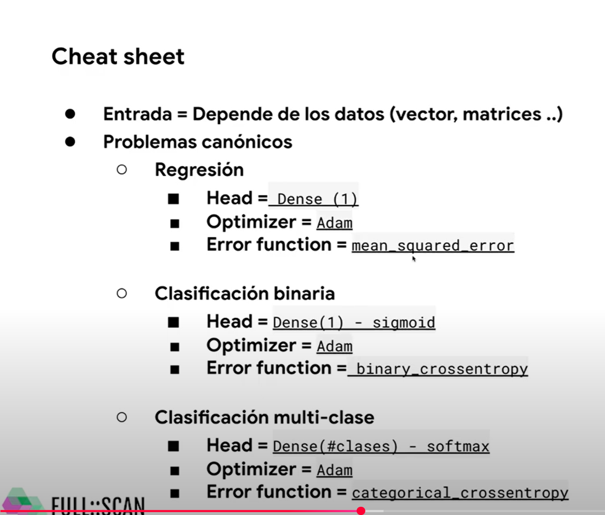

# Apuntes Tensorflow - Keras

---
# TensorFlow Tutorial 1 - Installation and Setup Deep Learning Environment (Anaconda and PyCharm)

https://www.youtube.com/watch?v=5Ym-dOS9ssA&list=PLhhyoLH6IjfxVOdVC1P1L5z5azs0XjMsb&index=1

Aladdin Persson
---

# TensorFlow Tutorial 2 - Tensor Basics

https://www.youtube.com/watch?v=HPjBY1H-U4U&list=PLhhyoLH6IjfxVOdVC1P1L5z5azs0XjMsb&index=2

Aladdin Persson

---
# TensorFlow Tutorial 3 - Neural Networks with Sequential and Functional API

https://www.youtube.com/watch?v=pAhPiF3yiXI&list=PLhhyoLH6IjfxVOdVC1P1L5z5azs0XjMsb&index=3

Aladdin Persson
---

---
# SimpleRNN, GRU y LSTM | 😱Redes neuronales RECURRENTES python KERAS [2022]

https://www.youtube.com/watch?v=bGcxrZMlJ2M&t=809s

---

TUTORIAL Primer modelo Deep Learning con TensorFlow en español | Clasificación binaria red neuronal

https://www.youtube.com/watch?v=NERPPvoj3Go

full scan

---

---

---

---