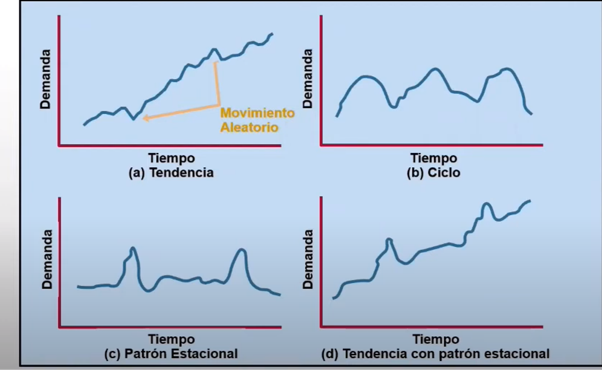
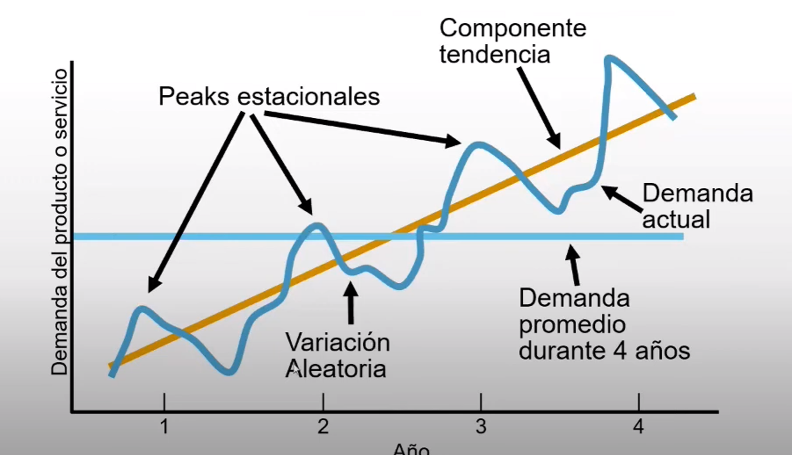
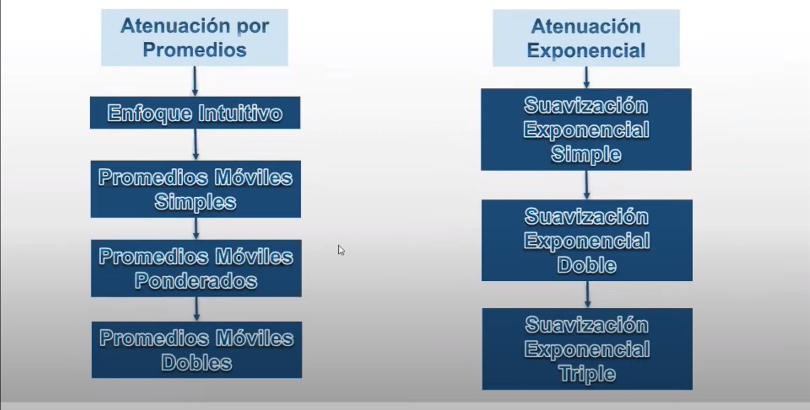

# Apuntes Python Curso - Bloque 2: Analisis predictivo

# Prediccion de valores numericos

## Regresion lineal

## Arboles de decision

DT (Decision Trees)

-Arboles de Regresion

-Arboles de clasificacion

cada nodo de decision

Impureza de los nodos hojas MSE(Mean Squared Error) error cuadratico medio

RMSE(Root-Mean squared Error)

Poda de un DT (Decision Trees)

Puede a haber problemas de sobreaprendizaje, sobreajuste o overfitting

## Solucion con arboles de decision

## Evaluacion de los modelos predictivos

### Tecnicas de evaluacion

- Validacion cruzada aleatoria (Kold-out)
- Validacion cruzada con k iteraciones (k-fold)
- Validacion cruzada dejando una muestra fuera(Leave-one-out)

## Introduccion al diseño de redes neuronales

### Neuronas artificiales

### Funciones de activacion

- Sigmoide
- ReLU (funcion rectificador lineal)

### Capas de neuronas

capas ocultas o capas intermedias

### Implementacion de redes neuronales en Python

Tensorflow o keras

### Capa de entrada

### Capa de salida

### Capas ocultas

### Compilacion y ajuste del modelo

### Solucion con redes neuronales

# Clasificacion binaria

clasificar elementos en categorias

- clasificacion binaria
- clasificacion multiclase

## Clasificacion mediante tecnicas de regresion

## Clasificacion mediante tecnicas de agrupamiento

- k-medias

## Introduccion a la maquinas de vectores de soporte

- maquinas de vectores

## Caracteristicas basicas de las SVM

## Busqueda de separabilidad en dimensiones superiores

kernel trick

## Ajuste de parametros con busqueda en cuadricula

## Evaluacion del rendimiento predictivo de un clasificador (I)

- matriz de confusion

- Exactitud, precision y sensibilidad(TPR)

### Equilibrio entre precision y sensibilidad

### Otras metricas obtenidas de la matriz de confusion

- Especifidad
- False Positive Rate(FPR)
- Kappa

## Entrenamiento de redes neuronales

# BLOQUE 3 - Analisis descriptivo

- Agrupamiento de datos
- Sistemas de recomendacion

## Agrupamiento de datos

Al analizar los tipos de problemas abordados mediante técnicas de aprendizaje automático, en el primer módulo del curso, distinguíamos entre algoritmos supervisados y no supervisados, entre otras opciones. Dependiendo del enfoque se obtienen modelos predictivos o bien descriptivos.

La regresión y la clasificación son técnicas supervisadas y generan modelos predictivos. Cada muestra de datos tiene asociada una variable objetivo cuyo valor numérico o etiqueta debe conocerse para llevar a cabo el entrenamiento.

Enfoque  aprendizaje no supervisado

El agrupamiento de datos tambien se le donomina *clustering*.

### Objetivo

- Se deben minimizar las diferencias entre muestras que pertenecen a un mismo grupo.
- Han de maximizarse las diferencias entre muestras pertenecientes a grupos diferentes.

Aparte se deben cumplir dos condiciones mas:

- La interseccion de dos grupos cualesquiera ha de ser el conjunto vacio.
- La union de todos los grupos es igual al conjunto de datos original.

### Tecnicas de agrupamiento:
- Partitivo
- Jerarquico
- Densidad

## Como medir la distancia entre dos muestras

- Distancia euclidea
- Distancia Manhattan
- Distancia del maximo

Generalizacion: distancias de Minkowski, incorpora las otras tres tipos de distancia.

Para p=1 distancia de Manhattan.
Para p=2 distancia euclidea
Para valores p grandes, tiende a infinito, se parecera a la distancia del maximo.

### OTras distancias: Levenshtein y coseno

- Distancia de Levenshtein.
- Similitud del coseno.

## Agrupamiento por particionamiento - k -medias

### Estandarizacion de magnitudes

 lo que hacemos es tomar el valor original de la variable, le restamos la media y dividimos entre la desviación típica. Al aplicar esta transformación a todas las variables les otorgamos el mismo peso a la hora de realizar el cálculo de las distancias.

### Como medir la similitud-distancia de grupos

### El algoritmo K-Medias

Ahora que contamos con las métricas de distancia entre muestras, intragrupo e intergrupo, que son las herramientas básicas, estamos en disposición de conocer el funcionamiento del algoritmo de particionamiento K-medias. Este consta de los pasos descritos a continuación:

1.Tomar k muestras del conjunto aleatoriamente y usarlas como centros iniciales de los grupos.
2.Recorrer todas las muestras del conjunto, asignando cada una de ellas al grupo cuyo centro tiene más cercano.
3.Recalcular los centros de los grupos ya formados a partir de las posiciones de las muestras que lo integran.
4.Volver al paso 2, repitiendo hasta que los centros de los grupos no cambien.

A partir de esta descripción podemos ver que K-medias es un algoritmo iterativo que tiene una componente aleatoria, los centros iniciales de los grupos, lo cual implica que puede no generar el mismo resultado cuando se ejecuta varias veces. El SSE global de cada ejecución nos permitirá determinar qué particionamiento es el mejor.

### Agrupamiento con k-medias en R.

Hay que instalar el paquete *stats*

kmeans(...) devuelve una estructura como la siguiente:

-cluster: un vector que indica el grupo al que se ha asignado cada una de las muestras del conjunto de datos
-centers:una matriz con k filas, una por grupo, y tantas columnas como dimensiones (variables) haya en el conjunto de datos, indicando el centro de cada grupo en el espacio.
-size:número de muestras asignadas a cada uno de los k grupos.
-tot.withinss: suma total de error cuadradico de los k grupos.

Dado que el algoritmo inicializa los centros de los grupos aleatoriamente,

### K-medias: estimación del número de grupos

De hecho, en muchos casos no sabremos de antemano si un mayor o menor número de grupos producirá un mejor agrupamiento o no.

### Estimación con la función pamk()

. Existen distintas estrategias para llevar a cabo una estimación. Una nos la ofrece la función *pamk()* del paquete *fpc*. Esta acepta múltiples parámetros de configuración, pero el único indispensable es el conjunto de datos a agrupar. La salida es una lista con varios datos, entre ellos el número de grupos óptimo en el campo nc. Esto nos permite ejecutar kmeans() estableciendo la cantidad de clústeres de manera más informada, como se muestra a continuación:

~~~
 clusters <- kmeans(datos, pamk(datos)$nc)

clusplot(datos, clusters$cluster, color = TRUE, lines = 0)
~~~

### Estimación analizando el SSE

Una estrategia alternativa a la ya explicada, que implica un procedimiento más manual para la estimación del número de grupos óptimo, consiste en analizar la evolución de la suma total del error cuadrático intragrupo a medida que se cambia el valor de 
k
k. Tendríamos que calcular la suma del error cuadrático o SSE de cada grupo generado, dato que kmeans() nos devuelve en el campo withinss, y a continuación totalizar todas esas sumas. Esta suma global también la calcula kmeans() y la facilita en el campo tot.withinss.

## Problemas del algoritmo k-medias

Inconvenientes:

- La necesidad de conocer de antemano el valor de k
- Su comportamiento aleatorio
- El hecho de que los grupos hayan de tener todos una misma forma y aproximadamente el mismo tamaño
- Su sensibilidad a los valores extremos u outliers

### Numero de grupos y aleatoriedad

- El primero estriba en que dicho algoritmo no es capaz de determinar por sí mismo el número de grupos apropiado a la hora de particionar el conjunto de datos.

- Establecer el número de grupos no es una tarea simple desde el momento en que cada muestra está definida por más de dos o tres variables, es decir, cuando se opera con espacios multidimensionales. En este contexto la visualización se hace compleja, sino imposible, reduciéndose su utilidad a la hora de decidirse por un valor u otro para 
k.

### Fallos al tratar con datos que tienen estructura compleja

### Conjuntos de datos en el paquete mlbench

### Resultados de K-medias sobre datos complejos

### Influencia de datos extremos

- Dado que el centro de los grupos generados por K-medias va actualizándose a medida que se asignan muestras a cada clúster, la existencia de outliers en el conjunto de datos tiene un impacto importante.

## Agrupamiento por densidad en R

-  En lugar de distribuir las muestras atendiendo a la distancia al centro del clúster más cercano, el agrupamiento por densidad se guía por el número de instancias que hay en la vecindad de una muestra dada, haciendo crecer el grupo sin que este necesariamente deba tener una forma o tamaño similar al resto de grupos.

### Conceptos previos

- ε-bola: se denomina una ε-ball y se define como la hiperesfera (recuerda que se trata de un círculo en 2D, una esfera en 3D y la estructura geométrica equivalente en dimensiones superiores) de radio ε tomando como centro un punto (una muestra de datos) elegido al azar.

- ε-vecindad: es el conjunto de muestras existentes dentro de una ε-bola. El tamaño de la ε-vecindad, definido como el número de puntos existentes, determina si un determinado punto es considerado como:
        - Punto de núcleo (core): se dice que una muestra es un punto core si su ε-vecindad supera un determinado tamaño.
        - Punto de borde: cuando el ε-vecindario de un punto no alcanza el tamaño mínimo, pero es una muestra que forma parte de la ε-vecindad de algún punto de núcleo, se dice que es de borde.
        - Ruido: el resto de las muestras, aquellas que no son de núcleo ni borde, se tratan como outliers, es decir, puntos que no pertenecen a una ε-bola.

### Algoritmo DBSCAN

1. Comienza seleccionando una muestra aleatoria del conjunto de datos, a la que llamaremos P

2. Se obtiene la ε-vecindad de P y se comprueba si su tamaño es igual o superior al número mínimo de puntos que se haya decidido.

3. Se marca P como punto ya visitado y se vuelve al inicio, seleccionando un nuevo punto que no haya sido procesado.

### Agrupamiento con DBSCAN en R

Encontraremos una implementación del algoritmo DBSCAN en el paquete fpc de R que, como es habitual, tendremos que instalar si no habíamos hecho uso de él con anterioridad. La función que ejecuta el algoritmo se llama dbscan() y precisa al menos dos parámetros:

### Uso basico de dbscan()

### Analisis de los grupos generados

### Limitaciones de DBSCAN

Aunque DBSCAN nos ofrecerá mejores resultados que K-medias en muchas ocasiones, este algoritmo también tiene algunas limitaciones. Las más destacables son:

- Problemas cuando hay muchas variables:

- Grupos de muestras de densidad homogénea:

## Agrupamiento jerárquico

- En ciertos problemas de agrupamiento desconocemos a priori el número de clústeres que queremos encontrar, y tampoco podemos asegurar que haya una distancia homogénea entre los clústeres ni entre las muestras internas a un clúster.

- A diferencia de los algoritmos de agrupamiento que hemos estudiado anteriormente, en el agrupamiento jerárquico no obtenemos un número fijo de grupos, sino una jerarquía de las instancias donde cada instancia es una hoja. La jerarquía nos relaciona las instancias más cercanas y, conforme subimos, se van relacionando los distintos grupos de instancias. Las relaciones bajas en la jerarquía conectan pocas instancias muy cercanas, y las relaciones altas cubren muchas instancias más lejanas entre sí.

### Interpretacion de dendogramas

### Construcción de la jerarquía

-Las jerarquías de grupos de ejemplos se construyen, en la mayoría de casos, de más específicos a más generales, es decir, de abajo a arriba.

Necesitamos, por tanto, algún criterio para hablar de una distancia entre un grupo y una instancia, y distancia entre grupos. Existen varios criterios que podemos utilizar, entre ellos tenemos:

- La mínima distancia entre cualquier elemento de cada grupo (llamado enlace simple)
- La máxima distancia entre todos los elementos de cada grupo (conocido como enlace completo)
- La distancia media entre los elementos de un grupo y los del otro (enlace media)
- La varianza del grupo que se forma a partir de ambos (criterio de Ward)

### Uso del agrupamiento jerárquico en Python

~~~
from scipy.cluster.hierarchy import dendrogram, linkage, fcluster
from sklearn.datasets import load_iris

from matplotlib import pyplot as plt

iris = load_iris()

~~~

La función que calcula el agrupamiento jerárquico es *linkage()*. Recibe varios parámetros, los más relevantes son los datos a agrupar y el criterio de agrupación. Además, se puede indicar la métrica a utilizar en el parámetro metric.

A continuación se enumeran los posibles valores del parámetro *method* que indica el criterio para agrupar datos:

- 'single': enlace simple
- 'complete': enlace completo
- 'average': enlace media
- 'weighted': enlace con pesos
- 'centroid': distancia entre centroides (el nuevo centroide es la media de los datos)
- 'median': distancia entre centroides (el nuevo centroide es la media de los anteriores)
- 'ward': varianza del nuevo grupo

Las métricas más importantes aceptadas por la función *linkage()* son las siguientes:

- 'chebyshev': la distancia del máximo o de Chebyshev
- 'cityblock': la distancia de Manhattan
- 'cosine': la distancia del coseno calculada como 1−cos(∠(A,B))1−cos(∠(A,B))
- 'euclidean': la distancia euclídea usual
- 'hamming': la distancia de Hamming (número de sustituciones entre cadenas de símbolos)
- 'minkowski': la distancia de Minkowski de orden p
- 'seuclidean': la distancia euclídea normalizada por la varianza de cada variable, útil si no estandarizamos previamente los datos
- 'sqeuclidean': la distancia euclídea al cuadrado (omite el cálculo de la raíz cuadrada)

## Sistemas de recomendación

## Conceptos sobre sistemas de recomendación (SR)

### Análisis de la cesta de la compra

Lo habitual es que el sistema parta de un registro de transacciones previas, como el que facilitan los OLTP. Por cada persona que realiza una compra, por ejemplo, en el supermercado, se registra cada uno de los productos adquiridos. Diferentes personas compran conjuntos de objetos distintos, lo cual permite establecer relaciones entre ellos. A esto es a lo que se denomina genéricamente Market Basket Analysis o análisis de la cesta de la compra. La colocación de los productos en las superficies de venta viene determinada por dicho análisis.

### Tipos de SR

- Filtrado de contenido.
- Filtrado colaborativo.

### Filtrado de contenido

Un SR basado en filtrado de contenido emplea únicamente los datos conocidos de los objetos con que trabaja, recurriendo a la similitud entre sus características para realizar una recomendación.

### Filtrado colaborativo

Los SR de filtrado colaborativo usan transacciones de múltiples personas, no guiándose por el contenido (las características) de los objetos sino por las relaciones entre estos, generalmente la coincidencia de elección de conjuntos de objetos por distintos usuarios.

### Sistemas hibridos

Observando con detalle los dos anteriores enfoques a la hora de construir un SR, es fácil darse cuenta de que no son excluyentes el uno del otro. Es decir, resulta factible llevar a cabo una combinación de ambos. Esta da lugar a los conocidos como SR híbridos o mixtos.

## El conjunto de datos Groceries

### El formato de archivo basket

### Estructura del conjunto de datos

### Carga del conjunto de datos

### Dimensiones del conjunto de datos

### Enumeración de las columnas

### Exploración de transacciones

### Frecuencias de los productos

## Introducción a las reglas de asociación

### ¿Qué es una regla de asociación?

### Métricas de evaluación de reglas de asociación

es necesario que conozcamos las métricas básicas que se emplean para evaluar la utilidad o interés de estas, ya que los algoritmos de minería de reglas se guían por dichas métricas.

#### Soporte de un itemset

#### Confianza de una regla

#### Lift de una regla

# BLOQUE4: Tecnicas avanzadas  y de ultima generacion

# Problemas avanzados en aprendizaje automatico

## Uso de multiples modelos para mejorar los resultados

### Tipos de Ensembles

---

Qué son y cómo crear Meta-Clasificadores o Meta-Regresores: Bagging en Machine Learning con Python

https://www.youtube.com/watch?v=NOiKfIhQG6A

Codigo Maquina

---

### Ensembles en R

### DEMO: uso de un ensemble frente a modelos simples

## Eliminacion de ruido en imagenes (autoencoders)

## Prediccion de series temporales

## articulos complementarios relacionados a series temporales

---
Introducción al modelo ARIMA

https://www.youtube.com/watch?v=HJ8yYAOcymg

---
Series de Tiempo Preprocesamiento de Datos en Python: Guía Completa Paso a Paso🧑‍💻

https://www.youtube.com/watch?v=143QAYwyAwY

---

Análisis de SERIES DE TIEMPO: guía completa

https://www.youtube.com/watch?v=6VvYgPXnB40

Codificando Bits

---

Análisis Exploratorio de Series de Tiempo con Gráficas de Autocorrelación y Retardo usando Python

https://www.youtube.com/watch?v=U-vdLHdyDLI

Codigo Maquina

---

Tutorial: ¿Cómo DESCOMPONER una serie de tiempo?

https://www.youtube.com/watch?v=g76KO0ctsus

Codificando Bits

---

Predice el Futuro y Conoce qué es el Pronóstico de Series de Tiempo: Una Introducción con Python

https://www.youtube.com/watch?v=vikPJJ3FsEs&list=PLat2DtY8K7YU4vmmVt1CX6lF4KBUAFbMG

Codigo Maquina

---

Análisis Exploratorio de Series de Tiempo con Gráficas de Autocorrelación y Retardo usando Python

https://www.youtube.com/watch?v=U-vdLHdyDLI&t=6s

Codigo Maquina

Analisis Visual de Series de tiempo

Graficas de Retardo

Graficas de autocorrelacion

---

Las 5 formas más Simples de Predecir el FUTURO en Series de Tiempo con Python: Media Móvil y ✚

https://www.youtube.com/watch?v=70U0WYL5KHg

Codigo Maquina

---

Pronóstico de Series de Tiempo con Suavización Exponencial Simple en Python: Prediciendo el Futuro

https://www.youtube.com/watch?v=BiRDgr-1eII&list=PLat2DtY8K7YU4vmmVt1CX6lF4KBUAFbMG&index=4

Codigo Maquina

---

El Modelo ARIMA

https://www.youtube.com/watch?v=U8gOgzSW5Ss

Aprendiendo Estadística

---

Análisis de Series de Tiempo y Pronósticos - Clase 01

https://www.youtube.com/watch?v=aUwXWGa8jK0

Carlos Monardes

Generar pronosticos:

1.Enfoque intuitivo.
2.Promedios moviles.
3.Suavización exponencial.
4.Analisis de tendencias
5.Analisis de Regresion.

Pronosticos de datos igualmente espaciados (semanales, mensuales,etc.)
-Obtenida a traves de observacion de la variable de respuesta en periodos de tiempo regulares

Pronostico basado solo en valores pasados (informacion historica)
-Se asume que los factores que han influido en el pasado e influyen en el presente seguiran influenciando en el futuro.

Descomposicion de las Series de Tiempo:

-Tendencia
-Estacional
-Ciclica
-Aleatoria

#### Componententes de las series de tiempo.

#### Componenentes de una demanda:

Componente Tendencia:

- Patron que represeta el incremento o decremento horizontal de una serie de tiempo durante cierto tiempo periodo.

- La tendencia puede ser parte de un ciclo economico, o bien trascender el ciclo.

- Se ve afectada por el ingreso, la poblacion, la tecnologia, la edad, la cultura,etc...

- Por lo general dura varios años

Componente Estacional:

- Patron de datos que se repite despues de un periodo de dias, semanas, meses o trimestres.
- Patron debido al clima, costumbres sociales y fiestas.
- Ocurre dentro de un año

Componente Ciclico:

- Patron que representa los altibajos de la actividad economica, y que se repita cada cierta cantidad de años.
- Es el mas dificil de indentificar y predecir.
- Afectados por ciclos de negocios, la politica y factores economicos.
- A menudo, las relaciones son asociativas (o causales).

Componente Aleatorio:

- Variaciones inexplicadas de los datos.
- Se puede deber a la casualidad o situaciones inusuales(huelgas,guerras,etc.)
- No representan ningun patron, y por ello no se pueden predecir.
- Tienen corta duracion y no son repetitivas.

#### Enfoque de la atenuacion(suavizacion) para las series de tiempo

#### Enfoque Intuitivo

- Asume que la demanda para el siguiente periodo sera igual a la que produjo en el periodo mas reciente.

Ejemplo si las ventas en Mayo fueron 48, entonces las ventas en Junio seran 48.

- Para algunas lineas de productos este enfoque resulta el mas efectivo en costos y mas eficiente con respecto al objetivo.

#### Promedios Moviles Simples (SMA)

- MA es una serie de medias aritmeticas.
- Usada si hay poca o nula tendencia.
- Usada frecuentemente para suavizar.
   Proporciona un panorama de los datos a traves del tiempo.

- Matematicamente, 

#### Promedios Moviles Ponderados (WMA)

- Usados cuando hay tendencia presente 
    Datos mas antiguos suelen ser menos importantes
- Ajusta el promedio de lso datos para reflejar mejor las fluctuaciones (estacionalidad)
- Las ponderaciones estan basados en experiencia e intuicion

---

