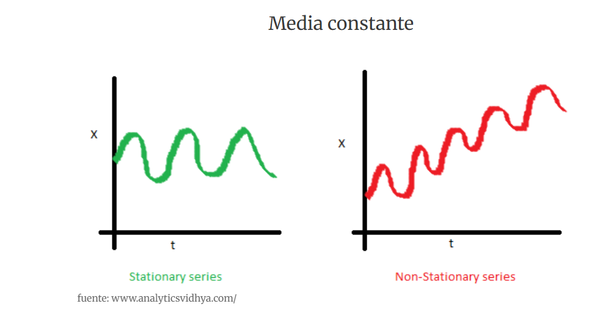
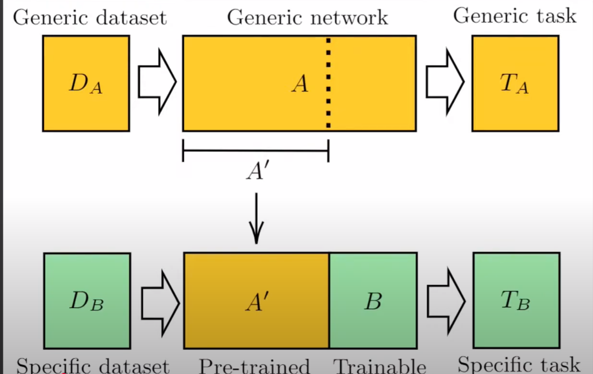

# Apuntes Python Curso - Bloque 2: Analisis predictivo

# Prediccion de valores numericos

## Regresion lineal

## Arboles de decision

DT (Decision Trees)

-Arboles de Regresion

-Arboles de clasificacion

cada nodo de decision

Impureza de los nodos hojas MSE(Mean Squared Error) error cuadratico medio

RMSE(Root-Mean squared Error)

Poda de un DT (Decision Trees)

Puede a haber problemas de sobreaprendizaje, sobreajuste o overfitting

## Solucion con arboles de decision

## Evaluacion de los modelos predictivos

### Tecnicas de evaluacion

- Validacion cruzada aleatoria (Kold-out)
- Validacion cruzada con k iteraciones (k-fold)
- Validacion cruzada dejando una muestra fuera(Leave-one-out)

## Introduccion al diseño de redes neuronales

### Neuronas artificiales

### Funciones de activacion

- Sigmoide
- ReLU (funcion rectificador lineal)

### Capas de neuronas

capas ocultas o capas intermedias

### Implementacion de redes neuronales en Python

Tensorflow o keras

### Capa de entrada

### Capa de salida

### Capas ocultas

### Compilacion y ajuste del modelo

### Solucion con redes neuronales

# Clasificacion binaria

clasificar elementos en categorias

- clasificacion binaria
- clasificacion multiclase

## Clasificacion mediante tecnicas de regresion

## Clasificacion mediante tecnicas de agrupamiento

- k-medias

## Introduccion a la maquinas de vectores de soporte

- maquinas de vectores

## Caracteristicas basicas de las SVM

## Busqueda de separabilidad en dimensiones superiores

kernel trick

## Ajuste de parametros con busqueda en cuadricula

## Evaluacion del rendimiento predictivo de un clasificador (I)

- matriz de confusion

- Exactitud, precision y sensibilidad(TPR)

### Equilibrio entre precision y sensibilidad

### Otras metricas obtenidas de la matriz de confusion

- Especifidad
- False Positive Rate(FPR)
- Kappa

## Entrenamiento de redes neuronales

# BLOQUE 3 - Analisis descriptivo

- Agrupamiento de datos
- Sistemas de recomendacion

## Agrupamiento de datos

Al analizar los tipos de problemas abordados mediante técnicas de aprendizaje automático, en el primer módulo del curso, distinguíamos entre algoritmos supervisados y no supervisados, entre otras opciones. Dependiendo del enfoque se obtienen modelos predictivos o bien descriptivos.

La regresión y la clasificación son técnicas supervisadas y generan modelos predictivos. Cada muestra de datos tiene asociada una variable objetivo cuyo valor numérico o etiqueta debe conocerse para llevar a cabo el entrenamiento.

Enfoque  aprendizaje no supervisado

El agrupamiento de datos tambien se le donomina *clustering*.

### Objetivo

- Se deben minimizar las diferencias entre muestras que pertenecen a un mismo grupo.
- Han de maximizarse las diferencias entre muestras pertenecientes a grupos diferentes.

Aparte se deben cumplir dos condiciones mas:

- La interseccion de dos grupos cualesquiera ha de ser el conjunto vacio.
- La union de todos los grupos es igual al conjunto de datos original.

### Tecnicas de agrupamiento:
- Partitivo
- Jerarquico
- Densidad

## Como medir la distancia entre dos muestras

- Distancia euclidea
- Distancia Manhattan
- Distancia del maximo

Generalizacion: distancias de Minkowski, incorpora las otras tres tipos de distancia.

Para p=1 distancia de Manhattan.
Para p=2 distancia euclidea
Para valores p grandes, tiende a infinito, se parecera a la distancia del maximo.

### OTras distancias: Levenshtein y coseno

- Distancia de Levenshtein.
- Similitud del coseno.

## Agrupamiento por particionamiento - k -medias

### Estandarizacion de magnitudes

 lo que hacemos es tomar el valor original de la variable, le restamos la media y dividimos entre la desviación típica. Al aplicar esta transformación a todas las variables les otorgamos el mismo peso a la hora de realizar el cálculo de las distancias.

### Como medir la similitud-distancia de grupos

### El algoritmo K-Medias

Ahora que contamos con las métricas de distancia entre muestras, intragrupo e intergrupo, que son las herramientas básicas, estamos en disposición de conocer el funcionamiento del algoritmo de particionamiento K-medias. Este consta de los pasos descritos a continuación:

1.Tomar k muestras del conjunto aleatoriamente y usarlas como centros iniciales de los grupos.
2.Recorrer todas las muestras del conjunto, asignando cada una de ellas al grupo cuyo centro tiene más cercano.
3.Recalcular los centros de los grupos ya formados a partir de las posiciones de las muestras que lo integran.
4.Volver al paso 2, repitiendo hasta que los centros de los grupos no cambien.

A partir de esta descripción podemos ver que K-medias es un algoritmo iterativo que tiene una componente aleatoria, los centros iniciales de los grupos, lo cual implica que puede no generar el mismo resultado cuando se ejecuta varias veces. El SSE global de cada ejecución nos permitirá determinar qué particionamiento es el mejor.

### Agrupamiento con k-medias en R.

Hay que instalar el paquete *stats*

kmeans(...) devuelve una estructura como la siguiente:

-cluster: un vector que indica el grupo al que se ha asignado cada una de las muestras del conjunto de datos
-centers:una matriz con k filas, una por grupo, y tantas columnas como dimensiones (variables) haya en el conjunto de datos, indicando el centro de cada grupo en el espacio.
-size:número de muestras asignadas a cada uno de los k grupos.
-tot.withinss: suma total de error cuadradico de los k grupos.

Dado que el algoritmo inicializa los centros de los grupos aleatoriamente,

### K-medias: estimación del número de grupos

De hecho, en muchos casos no sabremos de antemano si un mayor o menor número de grupos producirá un mejor agrupamiento o no.

### Estimación con la función pamk()

. Existen distintas estrategias para llevar a cabo una estimación. Una nos la ofrece la función *pamk()* del paquete *fpc*. Esta acepta múltiples parámetros de configuración, pero el único indispensable es el conjunto de datos a agrupar. La salida es una lista con varios datos, entre ellos el número de grupos óptimo en el campo nc. Esto nos permite ejecutar kmeans() estableciendo la cantidad de clústeres de manera más informada, como se muestra a continuación:

~~~
 clusters <- kmeans(datos, pamk(datos)$nc)

clusplot(datos, clusters$cluster, color = TRUE, lines = 0)
~~~

### Estimación analizando el SSE

Una estrategia alternativa a la ya explicada, que implica un procedimiento más manual para la estimación del número de grupos óptimo, consiste en analizar la evolución de la suma total del error cuadrático intragrupo a medida que se cambia el valor de 
k
k. Tendríamos que calcular la suma del error cuadrático o SSE de cada grupo generado, dato que kmeans() nos devuelve en el campo withinss, y a continuación totalizar todas esas sumas. Esta suma global también la calcula kmeans() y la facilita en el campo tot.withinss.

## Problemas del algoritmo k-medias

Inconvenientes:

- La necesidad de conocer de antemano el valor de k
- Su comportamiento aleatorio
- El hecho de que los grupos hayan de tener todos una misma forma y aproximadamente el mismo tamaño
- Su sensibilidad a los valores extremos u outliers

### Numero de grupos y aleatoriedad

- El primero estriba en que dicho algoritmo no es capaz de determinar por sí mismo el número de grupos apropiado a la hora de particionar el conjunto de datos.

- Establecer el número de grupos no es una tarea simple desde el momento en que cada muestra está definida por más de dos o tres variables, es decir, cuando se opera con espacios multidimensionales. En este contexto la visualización se hace compleja, sino imposible, reduciéndose su utilidad a la hora de decidirse por un valor u otro para 
k.

### Fallos al tratar con datos que tienen estructura compleja

### Conjuntos de datos en el paquete mlbench

### Resultados de K-medias sobre datos complejos

### Influencia de datos extremos

- Dado que el centro de los grupos generados por K-medias va actualizándose a medida que se asignan muestras a cada clúster, la existencia de outliers en el conjunto de datos tiene un impacto importante.

## Agrupamiento por densidad en R

-  En lugar de distribuir las muestras atendiendo a la distancia al centro del clúster más cercano, el agrupamiento por densidad se guía por el número de instancias que hay en la vecindad de una muestra dada, haciendo crecer el grupo sin que este necesariamente deba tener una forma o tamaño similar al resto de grupos.

### Conceptos previos

- ε-bola: se denomina una ε-ball y se define como la hiperesfera (recuerda que se trata de un círculo en 2D, una esfera en 3D y la estructura geométrica equivalente en dimensiones superiores) de radio ε tomando como centro un punto (una muestra de datos) elegido al azar.

- ε-vecindad: es el conjunto de muestras existentes dentro de una ε-bola. El tamaño de la ε-vecindad, definido como el número de puntos existentes, determina si un determinado punto es considerado como:
        - Punto de núcleo (core): se dice que una muestra es un punto core si su ε-vecindad supera un determinado tamaño.
        - Punto de borde: cuando el ε-vecindario de un punto no alcanza el tamaño mínimo, pero es una muestra que forma parte de la ε-vecindad de algún punto de núcleo, se dice que es de borde.
        - Ruido: el resto de las muestras, aquellas que no son de núcleo ni borde, se tratan como outliers, es decir, puntos que no pertenecen a una ε-bola.

### Algoritmo DBSCAN

1. Comienza seleccionando una muestra aleatoria del conjunto de datos, a la que llamaremos P

2. Se obtiene la ε-vecindad de P y se comprueba si su tamaño es igual o superior al número mínimo de puntos que se haya decidido.

3. Se marca P como punto ya visitado y se vuelve al inicio, seleccionando un nuevo punto que no haya sido procesado.

### Agrupamiento con DBSCAN en R

Encontraremos una implementación del algoritmo DBSCAN en el paquete fpc de R que, como es habitual, tendremos que instalar si no habíamos hecho uso de él con anterioridad. La función que ejecuta el algoritmo se llama dbscan() y precisa al menos dos parámetros:

### Uso basico de dbscan()

### Analisis de los grupos generados

### Limitaciones de DBSCAN

Aunque DBSCAN nos ofrecerá mejores resultados que K-medias en muchas ocasiones, este algoritmo también tiene algunas limitaciones. Las más destacables son:

- Problemas cuando hay muchas variables:

- Grupos de muestras de densidad homogénea:

## Agrupamiento jerárquico

- En ciertos problemas de agrupamiento desconocemos a priori el número de clústeres que queremos encontrar, y tampoco podemos asegurar que haya una distancia homogénea entre los clústeres ni entre las muestras internas a un clúster.

- A diferencia de los algoritmos de agrupamiento que hemos estudiado anteriormente, en el agrupamiento jerárquico no obtenemos un número fijo de grupos, sino una jerarquía de las instancias donde cada instancia es una hoja. La jerarquía nos relaciona las instancias más cercanas y, conforme subimos, se van relacionando los distintos grupos de instancias. Las relaciones bajas en la jerarquía conectan pocas instancias muy cercanas, y las relaciones altas cubren muchas instancias más lejanas entre sí.

### Interpretacion de dendogramas

### Construcción de la jerarquía

-Las jerarquías de grupos de ejemplos se construyen, en la mayoría de casos, de más específicos a más generales, es decir, de abajo a arriba.

Necesitamos, por tanto, algún criterio para hablar de una distancia entre un grupo y una instancia, y distancia entre grupos. Existen varios criterios que podemos utilizar, entre ellos tenemos:

- La mínima distancia entre cualquier elemento de cada grupo (llamado enlace simple)
- La máxima distancia entre todos los elementos de cada grupo (conocido como enlace completo)
- La distancia media entre los elementos de un grupo y los del otro (enlace media)
- La varianza del grupo que se forma a partir de ambos (criterio de Ward)

### Uso del agrupamiento jerárquico en Python

~~~
from scipy.cluster.hierarchy import dendrogram, linkage, fcluster
from sklearn.datasets import load_iris

from matplotlib import pyplot as plt

iris = load_iris()

~~~

La función que calcula el agrupamiento jerárquico es *linkage()*. Recibe varios parámetros, los más relevantes son los datos a agrupar y el criterio de agrupación. Además, se puede indicar la métrica a utilizar en el parámetro metric.

A continuación se enumeran los posibles valores del parámetro *method* que indica el criterio para agrupar datos:

- 'single': enlace simple
- 'complete': enlace completo
- 'average': enlace media
- 'weighted': enlace con pesos
- 'centroid': distancia entre centroides (el nuevo centroide es la media de los datos)
- 'median': distancia entre centroides (el nuevo centroide es la media de los anteriores)
- 'ward': varianza del nuevo grupo

Las métricas más importantes aceptadas por la función *linkage()* son las siguientes:

- 'chebyshev': la distancia del máximo o de Chebyshev
- 'cityblock': la distancia de Manhattan
- 'cosine': la distancia del coseno calculada como 1−cos(∠(A,B))1−cos(∠(A,B))
- 'euclidean': la distancia euclídea usual
- 'hamming': la distancia de Hamming (número de sustituciones entre cadenas de símbolos)
- 'minkowski': la distancia de Minkowski de orden p
- 'seuclidean': la distancia euclídea normalizada por la varianza de cada variable, útil si no estandarizamos previamente los datos
- 'sqeuclidean': la distancia euclídea al cuadrado (omite el cálculo de la raíz cuadrada)

## Sistemas de recomendación

## Conceptos sobre sistemas de recomendación (SR)

### Análisis de la cesta de la compra

Lo habitual es que el sistema parta de un registro de transacciones previas, como el que facilitan los OLTP. Por cada persona que realiza una compra, por ejemplo, en el supermercado, se registra cada uno de los productos adquiridos. Diferentes personas compran conjuntos de objetos distintos, lo cual permite establecer relaciones entre ellos. A esto es a lo que se denomina genéricamente Market Basket Analysis o análisis de la cesta de la compra. La colocación de los productos en las superficies de venta viene determinada por dicho análisis.

### Tipos de SR

- Filtrado de contenido.
- Filtrado colaborativo.

### Filtrado de contenido

Un SR basado en filtrado de contenido emplea únicamente los datos conocidos de los objetos con que trabaja, recurriendo a la similitud entre sus características para realizar una recomendación.

### Filtrado colaborativo

Los SR de filtrado colaborativo usan transacciones de múltiples personas, no guiándose por el contenido (las características) de los objetos sino por las relaciones entre estos, generalmente la coincidencia de elección de conjuntos de objetos por distintos usuarios.

### Sistemas hibridos

Observando con detalle los dos anteriores enfoques a la hora de construir un SR, es fácil darse cuenta de que no son excluyentes el uno del otro. Es decir, resulta factible llevar a cabo una combinación de ambos. Esta da lugar a los conocidos como SR híbridos o mixtos.

## El conjunto de datos Groceries

### El formato de archivo basket

### Estructura del conjunto de datos

### Carga del conjunto de datos

### Dimensiones del conjunto de datos

### Enumeración de las columnas

### Exploración de transacciones

### Frecuencias de los productos

## Introducción a las reglas de asociación

### ¿Qué es una regla de asociación?

### Métricas de evaluación de reglas de asociación

es necesario que conozcamos las métricas básicas que se emplean para evaluar la utilidad o interés de estas, ya que los algoritmos de minería de reglas se guían por dichas métricas.

#### Soporte de un itemset

#### Confianza de una regla

#### Lift de una regla

# BLOQUE4: Tecnicas avanzadas  y de ultima generacion

# Problemas avanzados en aprendizaje automatico

## Uso de multiples modelos para mejorar los resultados

Sabemos que los modelos predictivos, como son los arboles, las maquinas de vectores soporte o las redes neuronales, se generan mediante algoritmos de aprendizaje supervisado, tomando como entrada un conjunto de ejemplos, ya etiquetados con un valor numerico continuo(regresion) o discreto(clase) que son procesados para ajustar las caracteristicas del modelo en si mismo: estructura y variables de decision en los arboles, vectores soporte que determinan la frontera de separacion en las SVM, pesos en las conexiones entre nodos en las redes neuronales,etc.

En lugar de entrenar un unico modelo generamos varios, no identicos sino con sesgos e intereses diferentes, y a la hora de hacer una prediccion preguntamos a todos ellos y decidimos.

En ingles se llama a este uso conjunto de multiples modelos ensemble learning, denominando simplemente ensemble al conjunto de varios predictores. En adelante usaremos este termino preferentemente, ya que la denominacion comunmente aceptada en nuestro idioma, multiclasificador, en realidad puede tener varias interpretaciones diferentes.

### Tipos de Ensembles

En esta leccion se describiran los tres enfoques mas habituales a la hora de crear ensembles, concretamente ensembles de clasificadores que el tipo mas comun. En estos, cada modelo es un clasificador que genera como salida una etiqueta de clase. El ensemble puede estar compuesto por decenas o, mas habiutalmente, cientos de clasificadores individuales.

#### Aspectos generales

##### Diversidad en los modelos

Combinar multiples predictores con el objetivo de mejorar el resultado no tiene sentido si todos ellos son exactamente iguales, dado que en ese caso habria unanimidad en la salida siempre. Lo valioso de tener un conjunto de expertos, denominacion que tambien se usa al hablar de ensembles, es cuando cada uno de ellos aporta su conocimiento personal, desde una perspectiva ligeramente distinta al resto, de forma que la puesta en comun de todas las opiniones sea habitualmente mas acertada que la de un unico individuo.

Existen diferentes maneras de conseguir esa diversidad en los modelos, desde la generacion totalmente aleatoria de cada uno de ellos, la introduccion de alteraciones en la estructura o mediante ajustes de los parametros del modelo empleando subconjuntos de datos

Nota: los tres tipos de ensemble definidos mas adelante, bagging, boosting y random forest, son esencialmente tres enfoques para conseguir la diversidad en los modelos.

##### Estrategia de combinacion de salidas

Por otra parte, es preciso una estrategia para combinar las salidas de los modelos de forma que pueda obtenerse una prediccion unica por cada patron a evaluar. De esta forma, un ensemble de clasificadores se comportaria como un unico clasificador, tomando como entrada los valores de una muestra de datos y generando como salida la clase predicha.

La estrategia mas simple y usada es la del voto mayoritario, es decir, se selecciona como salida el valor que mas modelos sugieren. Asumiendo que tuviesemos n modelos en el ensemble, tal y como muestra en el siguiente diagrama, obtendriamos como resultado otras tantas predicciones. Un simple proceso de conteo de votos nos permitiria elegir el mas frecuente como prediccion final.

##### Ensembles homogeneos vs heterogeneos

Se dice que un ensemble es homogeneo cuando todos sus modelos son de la misma categoria: arboles, SVM, redes neuronales,etc. Es el tipo general de ensemble mas comun y los tres enfoques especificos que se detallan a continuacion son homogeneos.

No obstante, es posible diseñar ensembles usando modelos de diferentes categorias, por ejemplo una combinacion de arboles, SVM y redes neuronales. Esto aportaria mayor diversidad, uno de los requisitos detallados antes, pero a cambio eleva la complejidad del ensemble al tener que ajustar modelos que son de muy diversa naturaleza.

Nota: el modelo subyacente mas empleado para crear ensembles es el DT o arbol de decision. Este tiene la ventaja de ser facilmente interpretable y, en general, no se necesita un proceso de entrenamiento muy caro computacionalmente para crear decenas o cientos de arboles, en contraposicion a otros modelos como las redes neuronales.

##### Bagging

El nombre bagging procede de las partes inicial y final de la denominacion completa de esta tecnica: Bootstrap Aggregating. Asumiendo que se tiene un conjunto de datos D y que el tamaño del ensemble va a ser de m modelos, la tecnica de bagging consigue la diversidad en los modelos de la siguiente forma:

1. Se generan m versiones diferentes de D, a las que llamamos D´i, siendo i un valor ente 1 y m, empleando para ello la seleccion aleatoria uniforme con reemplazo. Si esos conjuntos de datos tienen el mismo tamaño que el original, este tipo de seleccion, conocida como bootstrap, implica que en cada uno de ellos tendremos 1-1/e(aproximadamente un 63%) de instancias unicas de D, mientras que el resto  seran instancias repetidas. Seran, por tanto, variantes ligeramente diferentes del conjunto de datos original.
2. Con cada conjunto de datos D´i se entrena un modelo Mi. Aunque bagging puede usar otro tipo de predictores, lo habitual es que los modelos sean arboles de decision. Al final tendriamos m arboles ajustados con conjuntos de datos ligeramente diferentes.
3. Se procesan las instancias de test entregando cada muesra a los m modelos y agregando los votos, estableciendo como clase de salida mas votada.
   
Nota: un aspecto interesante de bagging es que el proceso de entrenamiento de los m modelos es totalmente independiente, por lo que resulta facil de paralelizar consiguiendo la construccion del ensemble en un menor tiempo.

Gracias a la union de multiples modelos que no han visto datos, bagging permite reducir el sobreajuste y el sesgo que muestra un modelo individual, por lo que, tiene mejor rendimiento.

##### Bosting

La tecnica boosting para creacion de ensembles es mas sotisficada que la de bagging. La idea fundamental, usando la misma notacion previa para el dataset D y los modelos Mi i pertenece [1,m] se basa en los casos descritos a continuacion:

1. Se entrena el modelo Mi empleando las muestras en D.
2. Se evaluan los fallos que comete Mi identificando las muestras no correctamente clasificados.
3. Tras ajustar los pesos internos asociados tanto a las muestras como a los propios modelos del ensemble, se vuelve el paso 1 hasta completar los m modelos.
   
El paso 3 es fundamental, ya que mediante el ajuste de los pesos se consigue que el modelo Mi+1, otorgue mayor importancia a la correcta clasificacion de las muestras en las que Mi ha fallado. Por ello se dice que boosting es una tecnica iterativa, secuencial, en la que los modelos van construyendose en funcion de los resultados previos.

Nota: el proceso de construccion de un ensemble con la tecnica de boosting es inherentemente secuencial. A diferencia de bagging, no es facil de paralelizar ya que cada modelo se construye tomando en cuenta el resultado del anterior.

##### Random Forest

La propia denominacion de este tipo de ensemble, bosque aleatorio, transmite de foma indirecta cuales son los fundamentos en que se apoya: arboles de decision, la union de cientos de ellos forma un bosque, generados de forma aleatoria.

El punto de partida de random forest(RF en adelante) es el mismo que para la tecnica de bagging. Se generan m conjuntos de datos D´i a partir del D original, entrenando a continuacion m modelos ligeramente diferentes. La novedad respecto a bagging y que otorga una ventaja muy importante a RF, es que no solamente se toman de forma aleatoria instancias, si no que cada arbol se ajusta con un subconjunto distinto de atributos, tomados tambien aleatoriamente.

---
Clasificación usando Datos Desbalanceados

https://www.youtube.com/watch?v=3pxi3rsmM5o

Ciencia de Datos y AI

---

---

Qué son y cómo crear Meta-Clasificadores o Meta-Regresores: Bagging en Machine Learning con Python

https://www.youtube.com/watch?v=NOiKfIhQG6A

Codigo Maquina

---

### Ensembles en R

### DEMO: uso de un ensemble frente a modelos simples

## Eliminacion de ruido en imagenes (autoencoders)

Existen diferentes tipos de ruido que pueden afectar de distinta manera a la calidad de una imagen. El ruido gaussiano aditivo, por ejemplo, es uno de los mas comunes, donde cada pixel se desvia del color real siguiendo una distribucion normal

El tratamiento de ruido se puede abordar mediante una serie de filtros convencionales, que operan con los pixeles de una forma preestablecida para tratar de eliminar tipos de ruido conocidos. En la biblioteca Scikit-image de Python podras encontrar varios de estos filtros.

Sin embargo, en el caso de que queramos limpiar un tipo concreto de imagenes o estemos tratando con un tipo de ruido menos habitual, una solucion alternativa sera abordar la limpieza mediante metodos de aprendizaje automatico.

### Que es un autoencoder

En este caso, el problema que abordamos guarda una importante diferencia, y es que el modelo que construyamos no debe calcular como salida un simple valor numerico o de clase, sino un dato del mismo tamaño y estructura que el de entrada.

En los escenarios en que la salida de un modelo de aprendizaje debe generar datos complejos o con cierta estructura, es muy comun aprovechar el comportamiento de abstraccion de las redes neuronales para comprender una estructura de codificador-decodificador. En el componente codificador, se extrae la informacion relevante del dato de entrada y se computauna representacion mas util para la tarea que se esta optimizando.En el decodificador, se transforma la nueva representacion en una salida valida para el problema. Por ejemplo,este tipo de modelos son de los mas utilizados en traduccion de frase de un idioma a otro.

Una situacion especial para los modelos codificador-decodificador surge cuando el dato que debe salir de la red es igual o similar al de entrada. En muchas ocasione, lo que nos interesa puede ser la representacion intermedia que se alcanza en el codificador, puesto que nos puede informar acerca de las relaciones entre las instancias y descubrir estructura interta en el conjunto de datos. A veces tambien puede ser util la transformacion de entrada que se obtiene a la salida del modelo.

En cualquiera de estos casos, se puede trabajar con un tipo de estructuras codificador-decodificador denominados autoencoders.

### Representaciones y codigos

En un ambito comunicativo se suele llamar codigo al lenguaje que comparten el emisor y el receptor para poder entender los mensajes que se envian. Un mismo mensaje, por tanto puede tener varios representantes seguen el codigo que utilicemos.

### Arquitectura de un autoencoder

Un autoencoder, en esencia, es una red neuronal que aprende un codigo mas util de los datos de entrada mediante una estrategia de reconstruccion: la representacion debe servir para recuperar el dato original con la maxima fidelidad posible. De esa forma, nos aseguramos de que obtenemos representantes para nuestros datos que deben preservar suficiente informacion util como para, al menos, recuperar cada dato original

# Prediccion de series temporales

### Tipos de series temporales

- Univariadas
- Multivariadas

## Componentes de una serie temporal

Una serie temporal, entendida como la sucesión de valores que toma una cierta variable a lo largo del tiempo, generalmente puede ser descompuesta en múltiples partes. No todas las series temporales cuentan con todas las partes, pero muchas de ellas sí que lo hacen.

Hay una tendendencia y una periodicidad.

### Descomposicion de la serie

- La serie temporal original.
- La tendencia detectada en la serie.
- La Temporalidad de la serie.
- La componente aleatoria de la serie.

#### Tendencia de la serie
La tendencia(trend) de una serie tiene una influencia general sobre todos los valores de esta, marcando si a lo largo del tiempo hay una subida/bajada que se ajusta a una cierta funcion: linear,geormetrica y exponencial,etc.

#### Estacionalidad de la serie

La segunda componente que podemos encontrar en una serie es la temporalidad o estacionalidad. Esta se define como la parte que muestra un comportamiento repetitivo, con periodos fijos, a lo largo de toda la serie.

Nuestra serie de ejemplo tiene claramente una estacionalidad anual. Si observamos los picos y valles(valores maximos y minimos) en cada año, veremos que su forma es practicamente identica a la del año anterior o posterior. Es un comportamiento habitual, por ejemplo, en el consumo electrico. Dependiendo de la zona en que vivimos, el consumo aumentara en invierno, por efecto de la calefaccion, o bien en verano, si hay mucho aire acondicionado.

#### Componente aleatoria

La ultima parte de toda la serie temporal, *y esta existe siempre*, es la componente aleatoria. Su denominacion ya nos da una idea de su naturaleza: es la variacion de los valores que no queda explicada ni por la tendencia ni por la estacionalidad.

*una serie temporal que carece de tendencia y estacionalidad, constando unicamente de la parte aleatoria, se deonomina serie temporal estacionaria.*

#### <u>(Esta difinicion no esta en el curso sacado de un articulo de internet, no pertenece al curso, es una definicion complementaria ) https://estrategiastrading.com/series-estacionarias/ </u>

¿Que es una serie estacionaria?

Se dice que una serie de tiempo es estacionaria cuando su distribucion y sus parametros no varian con el tiempo.

En terminos mas concretos, la media y la varianza de una serie estacionaria no cambian con el tiempo ni tampoco siguen una tendencia.

La serie de la izquierda tiene una media constante, en cambio, la figura de la derecha muestra una tendencia, y su media se incrementa con el paso de tiempo.

#### ¿Que componentes tiene mi serie temporal?

El primer problema que suele afrontarse a la hora de trabajar con una serie temporal es determinar que componentes la forman. Con este objetivo suele recurrirse a dos herramientas: la visualizacion y los test estadisticos.

## Prediccion de series temporales con ARIMA

Examinando la literatura expecializada para localizar algoritmos de preccion de series temporales , observaremos que las posibilidades son muchas. Estas van desde los algoritmos estadisticos mas basicos, como son el suavizado expoencial y la media movil hasta las redes neuronales de ultima generacion como las LSTM. No obstante, es probable que haya un nombre con muchas menciones en libros y articulos: ARIMA.

Los metodos mas basicos de prediccion de series temporales cuentan con algunos condicionantes. Por ejemplo, es bastante habitual que dichos metodos precisen que la serie sea estacionaria. La conversion de una serie que no es estacionaria a otra que lo es, implica diferencia la serie original, quedandose con las diferencias entre cada punto en el tiempo y el anterior en lugar de con los valores absolutos originales.

Este proceso de diferenciacion puede tener que aplicarse varias veces hasta que se consigue que la media y la variacion son relativamente invariantes a lo largo de la serie.

Existen test estadisticos que permiten determinar si una serie temporal es estacionaria o no, tiene componente estacional o no. Generalmente, antes de aplicar un algoritmo de prediccion es preciso guiarse por estos test para aplicar  a la serie los preprocesamientos adecuados y elegir el modelo predictivo mas apropiado.

### ¿Que es ARIMA?

Frente a otras opciones puramente estadisticas, ARIMA es un modelo mas complejo con capacidad de afrontar la prediccion procesando series temporales que, no siendo estacionarias, no se hayan diferenciado ni de las que tampocose haya excluido la componente estacional. En relalidad, ARIMA es un *modelo compuesto de dos fases*: 

- una encarcada de hacer predicciones sobre una serie estacionaria 
- y otra a cargo de la parte estacionaria. 

El resultado de estas dos fases se agrega para obtener la prediccion final.

Para poder afrontar esta tarea, eximiento a quien realiza el estudio de tener que realizar manualmente el proceso de diferenciacion y separacion de la componente estacional, ARIMA no solo tiene en cuenta las dos fases de prediccion indicadas, sino que, ademas, se ocupa de llevar a cabo internamente tareas como la diferenciacion de la serie para convertirla en estacionaria.

### Parametros de entrda a ARIMA

La ejecucion de ARIMA precisara uno o dos conjuntos de parametros, dependiendo de que la serie temporal sobre la que se quiere aplicar tenga o no componente estacional. La notacion general de un modelo ARIMA concreto es ARIMA(p,d,q)(P,D,Q)m.El primer conjunto de parametros (p,d,q) determina como se tratara en general la serie; mientras que el segundo:(P,D,Q)m esta vinculado a la parte estacional.

- Con el parametro p se establece el orden de la parte autorregresiva de la serie.

# Deteccion de objetos en imagenes

## Conceptos fundamentales

Esencialmente, si tenemos una imagen diriamos que una deteccion consiste en dos cosas:

- Una region rectangular delimitada por 4 valores, dos de ellos indicarian la zona horizontal en la que se encuentran y los otros dos la zona vertical:

- Una identificacion de la tipologia de elemento que se encuentra dentro de dicha region, es decir, una clase. Lo habitual es que la clase vaya asociada a un nivel de confianza, de forma que podamos interpretar la seguridad que se tiene acerca de la calse predicha.

Un modelo de deteccion de objetos, en consecuencia, debe dar como salida una serie de tuplas(region,clase,confianza) de este tipo,identificando los diferentes objetos que sepueden reconocer en la imagen.

## Transfer Learning

### Redes neuronales para la deteccion de objetos

### Modelos multietapa

El principal exponente de los modelos que detectan objetos mediante al menos una etapa de obtencion de regiones de interes y otra de clasificacion de las regiones se llama R-CNN(Region-based Convolutional Neural Network, red neuronal convolucional basada en regiones).

Esta clase de modelos se basan en una arquitectura convolucional a la que se acopla un metodo de busqueda de regiones de interes. Para entrenar modelos, se pasan todas las regiones de interes de cada imagen a la red convolucional y esta se optimiza para clasificarlas correctamente como objetos de una determinada clase o bien fondo.

A continuacion, para cada clase, se entrena un modelo de maquina de vectores de soporte, que toma como entrada el mapa de caracteristicas de la ultima capa convolucional de la red. Para esta fase, se considera que una region contiene un objeto si se solapa en al menos un 30% con la caja definida en los datos de entrenamiento.

### Modelos de una etapa

#### YOLO

#### SSD

#### CenterNEt

# Busqueda de soluciones a problemas de optimizacion dificiles

## Problemas clasicos de optimizacion

### Problema del viajante de comercio (TSP)

### Problema de la mochila

### Problemas de optimizacion continua

### Metodos de optimizacion

- Metodos iterativos
- Algoritmos de optimizacion especificos
- Heuristicas

## Tecnicas de optimizacion evolutivas (heuristica y en este caso llamado soft computing)

### Funcionamiento general de las tecnicas evolutivas

1.Poblacion inicial
2.Evaluar individuos
3.Seleccionar y/o actualizar individuos
4.Nueva Poblacion

### Algoritmos de optimizacion basados en principios evolutivos/biologicos

- ACO - Colonias de hormigas
- SI - Inteligencia de colmena/enjambre
- PSO - Sistemas de particulas
- SA - Temple simulado
- ES - Estrategia evolutiva
- GA - Algoritmos geneticos

### Equilibrio entre explotacion y exploracion

## Algoritmos geneticos (GA)

La familia de metodos evolutivos la componen diferentes algoritmos, entre los cuales los conocidos como algoritmos geneticos(GA) son probablemente los mas famosos por su relativa sencillez y sus buenos resultados en terminos generales.

# Modelado generativo de datos

## Redes neuronales generativas

---
articulo complemento

GANs 101 - Una introducción práctica al mundo de las redes generativas

https://www.youtube.com/watch?v=XaVDgNtx5lA

IA Para Todos

---

# Los modelos funcionales del lenguaje

## articulos complementarios relacionados a series temporales

---
Introducción al modelo ARIMA

https://www.youtube.com/watch?v=HJ8yYAOcymg

---
Series de Tiempo Preprocesamiento de Datos en Python: Guía Completa Paso a Paso🧑‍💻

https://www.youtube.com/watch?v=143QAYwyAwY

---

Análisis de SERIES DE TIEMPO: guía completa

https://www.youtube.com/watch?v=6VvYgPXnB40

Codificando Bits

---

Análisis Exploratorio de Series de Tiempo con Gráficas de Autocorrelación y Retardo usando Python

https://www.youtube.com/watch?v=U-vdLHdyDLI

Codigo Maquina

---

Tutorial: ¿Cómo DESCOMPONER una serie de tiempo?

https://www.youtube.com/watch?v=g76KO0ctsus

Codificando Bits

---

Predice el Futuro y Conoce qué es el Pronóstico de Series de Tiempo: Una Introducción con Python

https://www.youtube.com/watch?v=vikPJJ3FsEs&list=PLat2DtY8K7YU4vmmVt1CX6lF4KBUAFbMG

Codigo Maquina

---

Análisis Exploratorio de Series de Tiempo con Gráficas de Autocorrelación y Retardo usando Python

https://www.youtube.com/watch?v=U-vdLHdyDLI&t=6s

Codigo Maquina

Analisis Visual de Series de tiempo

Graficas de Retardo

Graficas de autocorrelacion

---

Las 5 formas más Simples de Predecir el FUTURO en Series de Tiempo con Python: Media Móvil y ✚

https://www.youtube.com/watch?v=70U0WYL5KHg

Codigo Maquina

---

Pronóstico de Series de Tiempo con Suavización Exponencial Simple en Python: Prediciendo el Futuro

https://www.youtube.com/watch?v=BiRDgr-1eII&list=PLat2DtY8K7YU4vmmVt1CX6lF4KBUAFbMG&index=4

Codigo Maquina

---

El Modelo ARIMA

https://www.youtube.com/watch?v=U8gOgzSW5Ss

Aprendiendo Estadística

---

# Análisis de Series de Tiempo y Pronósticos - Clase 01

https://www.youtube.com/watch?v=aUwXWGa8jK0

Carlos Monardes

Generar pronosticos:

1. Enfoque intuitivo.
2. Promedios moviles.
3. Suavización exponencial.
4. Analisis de tendencias
5. Analisis de Regresion.

Pronosticos de datos igualmente espaciados (semanales, mensuales,etc.)
- Obtenida a traves de observacion de la variable de respuesta en periodos de tiempo regulares

Pronostico basado solo en valores pasados (informacion historica)
- Se asume que los factores que han influido en el pasado e influyen en el presente seguiran influenciando en el futuro.

Descomposicion de las Series de Tiempo:

- Tendencia
- Estacional
- Ciclica
- Aleatoria

#### Componententes de las series de tiempo.

#### Componenentes de una demanda:

Componente Tendencia:

- Patron que represeta el incremento o decremento horizontal de una serie de tiempo durante cierto tiempo periodo.

- La tendencia puede ser parte de un ciclo economico, o bien trascender el ciclo.

- Se ve afectada por el ingreso, la poblacion, la tecnologia, la edad, la cultura,etc...

- Por lo general dura varios años

Componente Estacional:

- Patron de datos que se repite despues de un periodo de dias, semanas, meses o trimestres.
- Patron debido al clima, costumbres sociales y fiestas.
- Ocurre dentro de un año

Componente Ciclico:

- Patron que representa los altibajos de la actividad economica, y que se repita cada cierta cantidad de años.
- Es el mas dificil de indentificar y predecir.
- Afectados por ciclos de negocios, la politica y factores economicos.
- A menudo, las relaciones son asociativas (o causales).

Componente Aleatorio:

- Variaciones inexplicadas de los datos.
- Se puede deber a la casualidad o situaciones inusuales(huelgas,guerras,etc.)
- No representan ningun patron, y por ello no se pueden predecir.
- Tienen corta duracion y no son repetitivas.

#### Enfoque de la atenuacion(suavizacion) para las series de tiempo

#### Enfoque Intuitivo

- Asume que la demanda para el siguiente periodo sera igual a la que produjo en el periodo mas reciente.

Ejemplo si las ventas en Mayo fueron 48, entonces las ventas en Junio seran 48.

- Para algunas lineas de productos este enfoque resulta el mas efectivo en costos y mas eficiente con respecto al objetivo.

#### Promedios Moviles Simples (SMA)

- MA es una serie de medias aritmeticas.
- Usada si hay poca o nula tendencia.
- Usada frecuentemente para suavizar.
   Proporciona un panorama de los datos a traves del tiempo.

- Matematicamente, 

#### Promedios Moviles Ponderados (WMA)

- Usados cuando hay tendencia presente 
    Datos mas antiguos suelen ser menos importantes
- Ajusta el promedio de lso datos para reflejar mejor las fluctuaciones (estacionalidad)
- Las ponderaciones estan basados en experiencia e intuicion

---

---

# Redes Neuronales Convolucionales - Transfer Learning

https://www.youtube.com/watch?v=4NgPVGt67Es

SensIO

puthorch

---

Procesamiento de Lenguaje Natural - Transfer Learning

https://www.youtube.com/watch?v=ZRtGW_ddkik

SensIO

---

# Deep Learning - 04 20 Ejemplo de transfer learning

https://www.youtube.com/watch?v=uWBg1Nr71nI

Math in the Tropics

---

